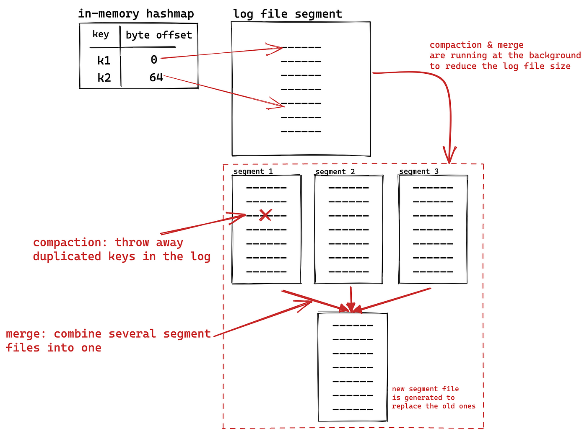
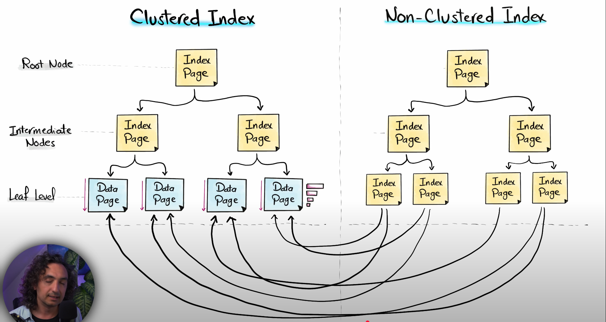
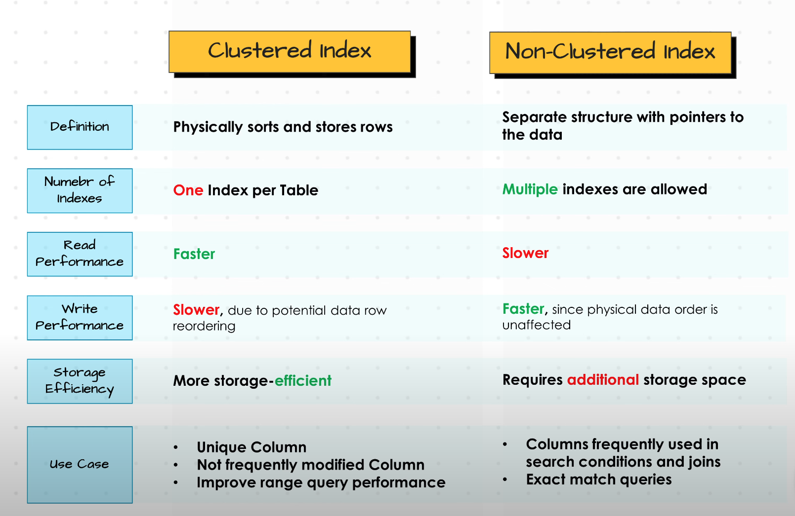
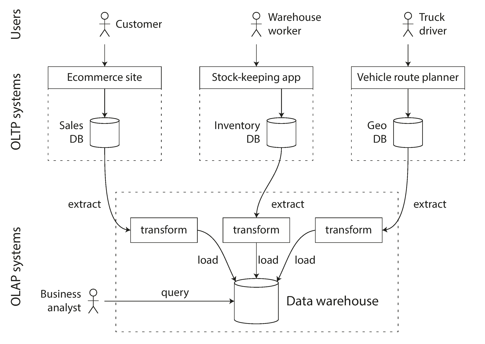
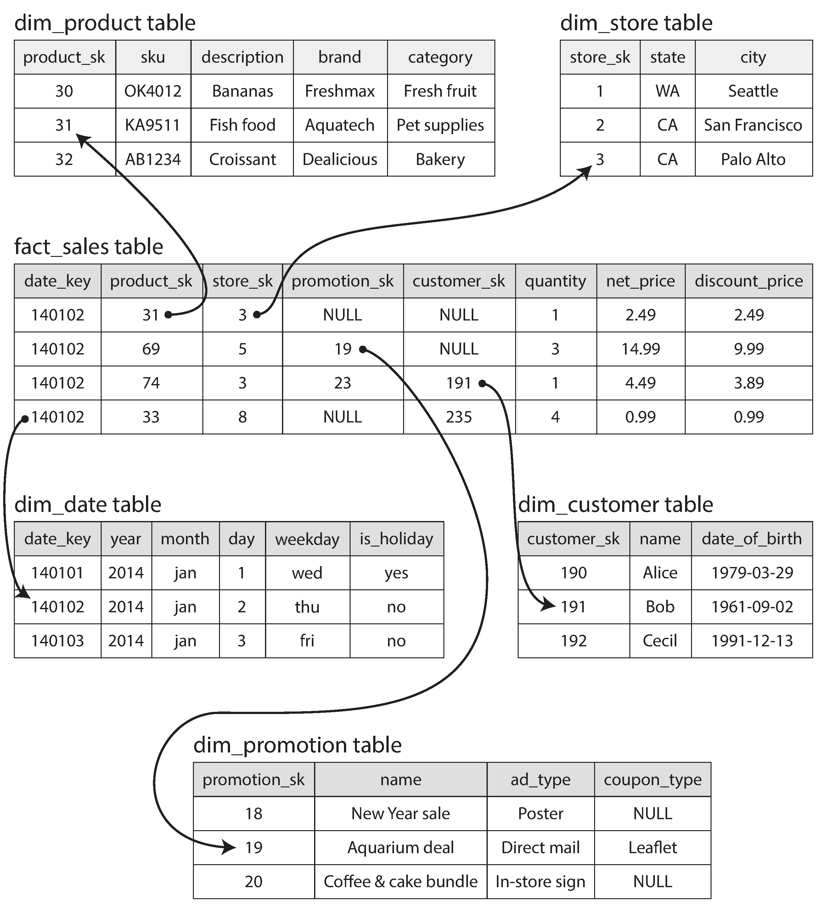
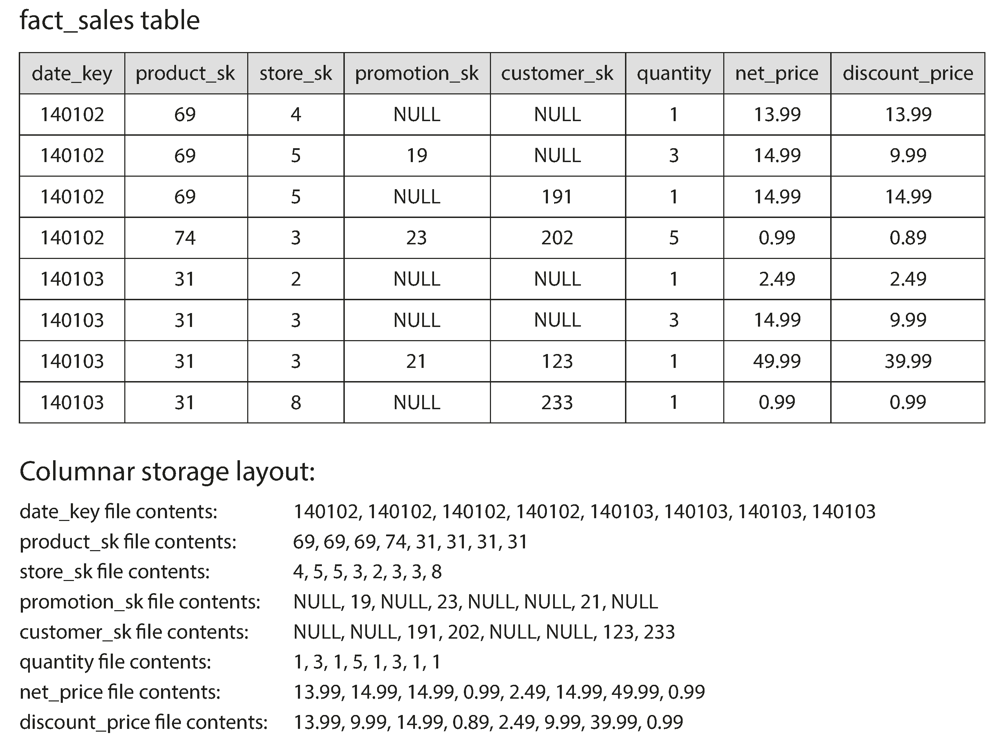
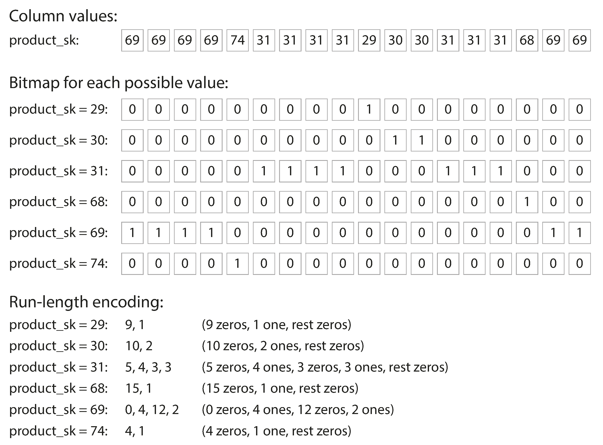
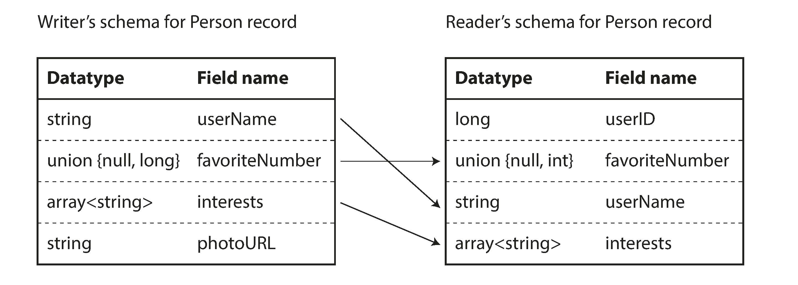

# Designing Data Intensive Applications Part-1 (Foundations of Data Systems)

## Chapter-1 Reliable, Scalable, and Maintainable Applications

3 factors that influence the design of a data system

1. Reliability
2. Scalability
3. Maintainability

### Reliability

System should be Fault tolerant/resilient

3 main kinds of faults

1. Hardware Faults
    1. Faults caused by infrastructure/hardware
    2. Common practices
        1. Redundancy of hardware, so you can restore a backup quickly.
        2. Systems that can tolerate the loss of an entire machine using software fault-tolerance techniques, rolling
           upgrade.
2. Software Errors
    1. Bugs in code can bring down applications across the board.
    2. Common practices
        1. Most software errors happen because of wrong assumptions. Try to make correct assumptions.
        2. Through testing, process isolation (should not impact other systems), measuring, monitoring and analyzing
           system behaviour.
3. Human Errors
    1. Common practices
        1. Design systems in a way that minimizes opportunites for error.
        2. decouple the places where people make the most mistakes from the places where they can cause failures.
        3. Test thoroughly at all levels
        4. Allow quick and easy recovery from human errors
        5. Setup detailed and clear monitoring

### Scalability

1. Describing load
    1. Find out what best describes load on your system, called load parameters. It can be request/sec, hit rate on a
       cache, ratio of reads to writes in a database, number of simultaneous active users in a chat room.
    2. Twitter fanout example
        1. Twitter's 2 main operations
            1. Post Tweet --> 4.6k req/sec on average, 12k req/sec peak.
            2. Home timeline --> 300k req/sec
        2. Approach 1:
            1. Post Tweet --> write to the database.
            2. Home timeline --> Read data from all the people user is following.
            3. Downsides:
                1. Since Home timeline requests outnumber the post tweet requests, system is slow due to heavy reads.
        3. Approach 2:
            1. Pre-compute the Home timeline and store in cache.
            2. Post Tweet --> write to the database, update the home timeline cache for all the followers.
            3. Home timeline --> Read from cache.
            4. Downsides:
                1. Although the home timeline reads are really quick, there is one exceptional case (celebrities)
                2. If a user has 30 millions followers, when writing a post it has to update 30 million home timeline
                   cache, which takes a lot of time.
        4. Approach 3: Hybrid of 1 & 2
            1. Use Approach 2 for all use cases except celebrities. For celebrities use Approach 1.
            2. Post Tweet --> write to the database, If not celebrity, update the home timeline cache for all the
               followers.
            3. Home timeline --> Read from cache, if user follows a celebrity, fetch from database.
2. Describing Performance
    1. Once you have described the load on your system, you can investigate what happens when the load increases.
        1. When you increase a load parameter and keep the system resources unchanged, how is the performance of the
           system affected.
        2. When you increase a load parameter, how much do you need to increase the resources if you want to keep
           performance unchanged.
    2. Latency
        1. The best way to check how users are impacted is not by getting the average response time, instead by getting
           the parameters like p99, p999 etc.
        2. If you places all request in order of their response time, the middle request corresponds to p50. Let's
           assume it took 1second for the middle request, it mean that 50% of the requests responded within 1s.
        3. Similarly, p99 refers to response time it took to respond to 99 percentile of the requests, p999 refers to
           99.9 percentile request. Optimizing for anything beyond that will incur a significant operations costs.
3. Approaches for coping with load
    1. Scaling up (vertical scaling)
    2. Scaling out (horizontal scaling)

### Maintainability

Majority of the costs of a software is not in its initial development, but in its ongoing maintenance, like fixing
bugs, keeping its system operations, investigating failures, adapting to new platforms, modifying for new use case etc.

3 principles of software development for maintainability:

1. Operability
    1. Making it easy for operations team to keep the system running smoothly.
2. Simplicity
    1. Make it easy for new engineers to understand the system, by removing as much complexity as possible from the
       system.
3. Evolvability
    1. Make it easy for engineers to make changes to the system in the future, adapting it for unanticipated use cases
       as requirements change. Also known as extensibility, modifiability or plasticity

## Chapter-2 Data Models and Query Languages

### The driving forces of NoSQL

1. Need for greater scalability
2. Restrictions on schemas
3. Specialized query operations that are not well supported in relational model.
4. Free and Open source

### Types of NoSQL databases

1. Document Database
    1. Use cases where data domes in self-contained documents and relationships between one document and another are
       rare
2. Graph Database
    1. targeting use cases where anything is potentially related to everything.

### Data Normalization:

Avoiding data duplication is called data normalization.  
ex: Take a persons resume, a person can have only one first/last name, but can have many jobs. Saving all the job
information in the person table will duplicate the data, since other users can also have the same job. So we move the
jobs to a separate table, and use the job id's are foreign keys in users table. This avoids data duplication.

Normalizing the data also means there will be relations (one-to-many/many-to-many). Relational database handles this
very easily, but document databases does not support this well.

However, Document databases and relational databases follow a similar approach, they both save a reference to the
foreign
table in the main table. But Relational databases are more tuned towards joins.

### Schema Flexibility

It is generally regarded the Document databases does not have schema. But that is not true, as the code that reads the
data usually assumes some kind of structure.So there is an implicit schema, but only interpreted when the data is read.

***Schema-on-read*** : No schema when writing, but assumes schema on reading the data.  
***Schema-on-write*** : Schema on write like relations databases follow, the same schema is enforced in the application
as well.

Below is an example, lets assume you want to split the users fullname to first/last name.

#### Relational databases :

1. Create two new columns (firstName, lastName)
2. Update the first/last name for existing records by split the fullName.
    ```
        ALTER TABLE users ADD COLUMN first_name varchar;
        UPDATE users set first_name = split_part(fullName, ' ',1);
    ```
3. Make changes in the application to read from new columns.

#### NoSQL Databases:

1. update the application code to read from fullName if exists, else read from firstName/lastName
   ```
       if(user && user.name && !user.firstName){
           user.firstName=user.name.split(" ")[0];
       }
   ```

### Data locality for queries

A document is usually stored as a single continuous string, encoded as JSON, XML or a binary variant. If you application
often needs access to the entire document, there is a performance advantage to this storage locality.
But if you need access to a portion of the document, you still need to fetch the entire document, which is wasteful of
resources.

Similarly, if you want to update only a portion of the document, you still need to update the entire document.

For these reasons, it is generally recommended to keep the documents fairly small and avoid writes that increases the
size of the database.

If the data is split across multiple tables, multiple index lookups are required to retrieve it all, which may require
more disk seeks and take more time.

### Convergence of Relational and NoSQL databases:

Relational databases like PostgreSQL, MySQL, IBM DB2 all started supporting JSON documents.

Document databases like RethinkDB supports relational like joins in its query language, MongoDB drivers automatically
resolve database references.

A hybrid of relational and document models is good route for databases to take in the future.

### When to choose Relational/Document/Graph database

#### Relational Database

1. For highly interconnected data, i.e If your application uses a lot of one-to-many/many-to-many relationships
    1. Compare to Document DB: Joins can be emulated in application code by making multiple requests to the database,
       but that also moves complexity into the application and is usually slower that a join performed by specialized
       code inside the database.
2. Transactions are needed (ACID)

#### Document Database

1. If the data in your application has a document like structure (i.e. a tree of one-to-many relationships, where
   typically the entire tree is loaded at once)
    1. Compare to Relational DB: The relational technique of shredding/splitting a document like structure into multiple
       tables can lead to cumbersome schemas and unnecessary complicated application code.
2. Schema Flexibility

#### Graph Database

1.

### Query Languages

1. MapReduce - supported by CouchDB and MongoDB
2. Aggregation pipeline - supported by MongoDB
3. Cypher Query Language - used for graph databases
4. Triple Store and SPARQL
5. Datalog - Old but foundational to Triple store and SPARQL

## Chapter-3 Storage and Retrieval

1. OLTP (Online Transactional Processing)
2. OLAP (Online Analytics Processing)

### OLTP (Online Transactional Processing)

### Data Structures powering your Database

1. Relational Database
    1. Indexes
        1. HashMap Indexes
        2. B-Trees Indexes
    2. Storage
        1. Clustered Storage (B+ tree)
        2. Heap file Storage
    3. WAH (write ahead log)
2. Non-Relational Database
    1. LSM Trees & SS Tables
    2. WAH (write ahead log)

### HashMap Indexes and log-structured storage

The initial approach to storing is to append data to a file using comma separated key value pairs, and maintaining a
hashtable of indexes of the keys. This also means that updates are appended to the end the log file instead of updating
the corresponding row. Any deletions are marked as "Tombstone" at the end of the log file, meaning this record is
deleted. After a certain threshold, the log file is stored as segment and will not be overridded. A process known as
compaction is performed periodically to combine the duplicate records and stored as segments.

Downsides:

1. No range queries are supported, you would end up reading the entire file.
2. All the indexes are stored in memory, this would be problematic for huge databases.

Upsides:

1. High write speeds, since it's just appending to a log file.
2. Concurrency and crash recovery are much simpler, since you just append to a file.
2. This also laid the foundation to LSM trees and SS Tables which is used in NoSQL databases.



### LSM Trees and SS Tables:

SS Tables are very similar to above approach, except that our segment files are sorted. Hence, it's called SS Table (
Sorted String Table). But simply appending to the log file will not stored them sorted, so we write to a Data Structure
called LSM Tree/Memtable (which is a height balanced tree,like AVL/red black trees), which when reached a certain
threshold will save the data to a SS Table in a sorted order.

Since the LSM Tree is stored in memory, there is a chance of losing the data. So a WAL is maintained for
disaster recovery. This log file can be cleared, when the memtable is converted to SS Table.

Since the segments are sorted, you do not need to save the indexes of each record, you just need to store only few
indexes and the record can be found using binary search. This storing of few indexes per segment is called Sparch
Indexing.

Searching for records that does not exist is time taking, so a **bloom filter** is used which tells if a record does not
exist in constant time.


### B-Trees:

The B-Trees (Binary Trees) are used to store the indexes in relational databases. The actual data is stored in the form
of heaps and the indexes to them are stored in the B-Trees.

B-Tree breaks the database into fixed-size blocks or pages, traditionally 4kb in size, and read or write one page at a
time. Each page can be identified as an address or location, which allows one page to refer to another, similar to a
pointer, but on disk.

One page is designated as the root of the B-tree, whenever you want to lookup a key in the index, you start here. The
page contains several keys and references to child pages. Each child is responsible for a continuous range of keys, and
the keys between the references indicate where the boundaries between hose ranges lie. Eventually we get down to a page
containing individual keys (a leaf page), which either contains the value for each key inline or contains references to
the pages white the values can be found. The number of references ot child pages in on e pge of the B-tree is called the
**branching factor**. The tree is made sure that it remains balanced, so the depth of the tree never exceeds O(logn). A
four level tree of 4kb pages with a branching factor of 500 can store upto 256TB.

In order to make the database resilient to crashes, it is common for B-trees to use a WAL.

#### Clustered and Heap Storage:

The actual data is stored in 2 ways,

1. Stored in random available place on the disc. The B-tree leaf nodes point to this location on the disc.
2. Stored at the leaf nodes of the B-Tree, which means all the data is available on the B-Tree itself. This is called
   Clustered Storage.

#### Clustered Index vs Non-Clustered Index

When creating a table, you have the option to choose clustered and non-clustered indexes.

In a clustered storage, the data can will be stored in the order of the clustered index. So, for one table there can be
only clustered index, since the data can be sorted in one way.

Non-clustered indexes refers to new B-tree indexes that point to the records in the clusterd index (since all the
records are saved here)




### B-Trees vs LSM Trees:

|                       | B-Trees                                                                  | LSM Treds                                       |
|-----------------------|--------------------------------------------------------------------------|-------------------------------------------------|
| Structure             | Hierarchical, balanced tree                                              | log-structured, append only                     |
| Read performance      | Fast reads, predictable lookup times                                     | Slower reads due to data spread across segments |
| Write pattern         | random writes across the tree                                            | Sequential, append only writes                  |
| Compaction            | Not Needed                                                               | Needs periodic compaction                       |
| Transactional Support | Since each key exist only once, you can place locks used in transactions | Not preferred for transactions                  |
| Best for              | Read heavy workloads, range queries                                      | Write heavy workloads, high insert rates        |

1. As a rule of thumb, LSM Trees are typically faster for writes, whereas B-trees are faster for reads.
2. Reads are typically slower in LSM Tres as they have to check several different datastructures and SSTables at
   different stages of compaction.
3. LSM treees are typically able to sustain higher write throughput than B-Trees, partly because they have lower write
   amplification and partly because they sequentially write compact SSTable files rather than having to overwrite
   several pages in the tree.
4. The downside of LSM-tree is that the compaction process can sometime interfere with the performance of ongoing reads
   and writes. If write throughput is high and compaction is not configured carefully, it can happen that the compaction
   cannot keep up with the rate of incoming writes.
5. An advantage of B-Tree is that each eky exists in exactly one place in the index, whereas log-structured storage may
   have multiple copies of the same key in different segments. This aspect makes B-trees attractive in databases that
   want to offer strong transactional semantics, in many relational databases transaction isolation is implemented using
   locks on range of keys, and in a B-tree index, those logs can be directly attached to the tree.

### OLAP (Online Analytics Processing)

### Data Warehousing

The OLTP systems are usually expected to be highly available and to process transactions with low latency, since thery
are often critical to the operation of the business. Database administrators therefor closely guard their OLTP
databases.

A data warehouse, is a separate database that analysts can query, without affecting OLTP operations. The data warehouse
contains a read-only copy of the data in all the various OLTP systems in the company. Data is extracted from OLTP
databases (using either a periodic data dump or a continuous stream of updates), transformed into an analysis-friendly
schema, cleaned up, and then loaded into the data warehouse. This process of getting data into the warehouse is known as
Extract–Transform–Load (ETL)



The data model of a data warehouse is most commonly relational, because SQL is generally a good fit for analytic
queries. There are many graphical data analysis tools that generate SQL queries, visualize the results, and allow
analysts to explore the data (through operations such as drill-down and slicing and dicing). On the surface, a data
warehouse and a relational OLTP database look similar, because they both have a SQL query interface. However, the
internals of the systems can look quite different, because they are optimized for very different query patterns.

Data is stored in many different formats

1. Stars and Snowflakes
    1. At the center of the schema is a so-called fact table (in this example, it is called fact_sales). Each row of the
       fact table represents an event that occurred at a particular time (here, each row represents a customer’s
       purchase of a product). If we were analyzing website traffic rather than retail sales, each row might represent a
       page view or a click by a user.
    2. Usually, facts are captured as individual events, because this allows maximum flexibility of analysis later.
       However, this means that the fact table can become extremely large. A big enterprise like Apple, Walmart, or eBay
       may have tens of petabytes of transaction history in its data warehouse, most of which is in fact tables
    3. The name “star schema” comes from the fact that when the table relationships are visualized, the fact table is in
       the middle, surrounded by its dimension tables; the connections to these tables are like the rays of a star. A
       variation of this template is known as the snowflake schema, where dimensions are further broken down into
       subdimensions. For example, there could be separate tables for brands and product categories, and each row in the
       dim_product table could reference the brand and category as foreign keys, rather than storing them as strings in
       the dim_product table. Snowflake schemas are more normalized than star schemas, but star schemas are often
       preferred because they are simpler for analysts to work with.
       In a typical data warehouse, tables are often very wide: fact tables often have over 100 columns, sometimes
       several hundred. Dimension tables can also be very wide, as they include all the metadata that may be relevant
       for analysis—for example, the dim_store table may include details of which services are offered at each store,
       whether it has an in-store bakery, the square footage, the date when the store was first opened, when it was last
       remodeled, how far it is from the nearest highway, etc.
       
2. Column-Oriented Storage
    1. If you have trillions of rows and petabytes of data in your fact tables, storing and querying them efficiently
       becomes a challenging problem. Dimension tables are usually much smaller (millions of rows), so in this section
       we will concentrate primarily on storage of facts. Although fact tables are often over 100 columns wide, a
       typical data warehouse query only accesses 4 or 5 of them at one time
    2. In most OLTP databases, storage is laid out in a row-oriented fashion: all the values from one row of a table are
       stored next to each other. Document databases are similar, an entire document is typically stored as one
       contiguous sequence of bytes.
    3. The idea behind column-oriented storage is simple: don’t store all the values from one row together, but store
       all the values from each column together instead. If each column is stored in a separate file, a query only needs
       to read and parse those columns that are used in that query, which can save a lot of work.
    4. The column-oriented storage layout relies on each column file containing the rows in the same order. Thus, if you
       need to reassemble an entire row, you can take the 23rd entry from each of the individual column files and put
       them together to form the 23rd row of the table.
       
3. Column Compression
    1. Besides only loading those columns from disk that are required for a query, we can
       further reduce the demands on disk throughput by compressing data. Take a look at the sequences of values for
       each column in Figure 3-10: they often look quite repetitive, which is a good sign for compression. Depending on
       the data in the column, different compression techniques can be used. One technique that is particularly
       effective in data warehouses is bitmap encoding
       
    2. Often, the number of distinct values in a column is small compared to the number of rows (for example, a retailer
       may have billions of sales transactions, but only 100,000 distinct products). We can now take a column with n
       distinct values and turn it into n separate bitmaps: one bitmap for each distinct value, with one bit for each
       row. The bit is 1 if the row has that value, and 0 if not.
       If n is very small, those bitmaps can be stored with one bit per row. But if n is bigger, there will be a lot of
       zeros in most of the bitmaps (we say that they are sparse). In that case, the bitmaps can additionally be
       run-length encoded, as shown at the bottom of. This can make the encoding of a column remarkably compact. Bitmap
       indexes such as these are very well suited for the kinds of queries that are common in a data warehouse.
4. Sort Order in Column Storage
    1. In a column store, it doesn’t necessarily matter in which order the rows are stored. It’s easiest to store them
       in the order in which they were inserted, since then inserting a new row just means appending to each of the
       column files. However, we can choose to impose an order, like we did with SSTables previously, and use that as an
       indexing mechanism.
    2. Advantage of sorted order is that it can help with compression of columns. If the primary sort column does not
       have many distinct values, then after sorting, it will have long sequences where the same value is repeated many
       times in a row. A simple run-length encoding, like we used for the bitmaps, could compress that
       column down to a few kilobytes—even if the table has billions of rows.

### References

1. [B-Trees](https://www.youtube.com/watch?v=K1a2Bk8NrYQ)
2. [LSM Trees and SS Tables](https://www.youtube.com/watch?v=I6jB0nM9SKU)
3. [Clustered vs Non Clustered Indexes](https://www.youtube.com/watch?v=BxAj3bl00-o)
4. [Column Oriented Storage](https://youtu.be/Zt7rqtJ3uWA?si=W0v5jtKYvJx42_R_)

## Chapter-4 Encoding and Evolution

This chapter mainly talks about the data formats/schemas that are used to store the data for Non-Relational databases.
This is not an issue with relational databases, because they follow a strict schema and all the data is stored in the
same format. Any changes to the data formats involves schema changes, like adding/deleting a column, updating the
name/datatype of a column all require a schema change using ALTER table. So, at any given point of time, there is only
one schema that the data has to abide to.

However, Non-Relational databases are very flexible, they do not have a schema in place. So it is possible that the
database can multiple different schemas at the same time. The burden falls on the application code to parse this data.
So, any schema changes to the data while writing should make sure that they are backward and forward compatible by the
application code.

**Standard Data Formats Used:**

1. JSON
2. XML
3. CSV

You might assume that they use JSON as standard format, but that's not true. Yes most of them use JSON because they are
widely accepted, but they are not memory efficient, you need to specify the "key" name for every single record.
Companies still use it because it's hard to get all consumers to agree on a format for data transfer.

However, for
data that's limited within the company, they can implement a better schema.

1. Language Specific Formats
2. Byte Encoding
3. Protocol Buffers and Thrift
4. Avro

#### Language Specific Formats

Every language has its own serialization library, which encodes the Objects to bytes and can be saved to database. This
may sound very convenient, but you are restricting yourself to just one language.

#### Byte Encoding

This is not the most efficient way, but it does save some memory converting the data to binary format. But it is not
significant enough to sacrifice the readability of the data.

### Protocol Buffers and Thrift

Protocol Buffers (by Google) and Thrift (by Facebook) are very similar. They enforce a schema on the data and provide
options to modify the schema.

```
Protocol Buffer Schema:

message Person {
    required string user_name = 1;
    optional int64 favorite_number = 2;
    repeated string interests = 3;
}

Thrift Schema:

struct Person {
    1: required string userName,
    2: optional i64 favoriteNumber,
    3: optional list<string> interests
}


For both Schemas, Data stored as below

{
   1: "ravi",
   2: 10,
   3: [ "reading", "sports" ]
}

```

The data is stored using the field id (number) instead of filed name (userName/favoriteNumber). This saves a lot of
memory. However, it also comes with downsides, Although the data does not use the filed names, they are restricted to
fieldId. You can add new filedId's but the existing Ids cannot be changed. They can be removed if the field is marked as
optional, but the Id should not used by other fields.

Adding - create a new fields ID and your application code can start reading the data for the new field. Make sure you
add the new field as optional, so it is backward compatible, meaning old applications does not break while reading.

Deleting - you can only delete an optional field, and the id should not be used by other fields.

Updating - you can rename the field as you like, but changing the datatype is tricky, you risk loosing precision or data
getting truncated.

### Avro by Apache

Avro provides little flexibilty in terms of schema updates. It just concatinates the values together, there will be no
indication of the filed name or filed tag or datatype. It just encodes them to 32bit long and stores them. The only way
you can decode the data or make sense of the data is if you have the schema. The values are stored in the same order of
the schema, the datatypes are inferred from schema. If you do not have the schema, you cannot decode the data.

```
Avro Schema: 

record Person {
    string userName;
    union { null, long } favoriteNumber = null;
    array<string> interests;
}
```

This is very flexible, adding/deleting/updating all becomes very easy, because the data does not have any clue of the
field names or datatypes.

Now, there could exist multiple schemas at the same time, meaning the data could be written by an two applications that
follow two different schemas, this is supported, below is how.

#### Read Schema vs Write Schema

An application will get 2 schemas to decode the data properly, one is write schema (the schema used when writing the
data), and read schema (the schema used to read the data). This makes it easier understand the data, the order of the
records, datatypes, missing fields etc. If a particular field is missing, it takes the default value provided at the
time of defining the schema.



### Dataflow through Databases

Now that the format and storage is handled, lets take about data transfer protocols. There are 3 main

1. Databases, where the process of writing and reading happens on the database itself.
2. REST API and RPC
3. Message Brokers (Asynchronous Processing)

The most popular way of data transfer b/w applications is via REST API, generally using JSON format. Some webservices
also use SOAP which is XML based.

RPC is an old protocol which has many flaws, so there are new protocols developed on top of RPC like gRPC (implemented
using Protocol Buffers). gRPC supports streams, where a call consists of not just one request and one response, but a
series of request and responses over time.

Message Brokers are also used to transfer the data asynchronously. Message Brokers like TIBCO, IBM WebSphere are
dominating in commercial enterprise, but lately other brokers like rabbitMQ, ActiveMQ, HornetQ, NATS and Apache Kafka
are becoming popular.

### References

1. [Data Serialization frameworks ](https://youtu.be/E7Gk8etqkgU?si=PoD682oWB1RJw-4h)