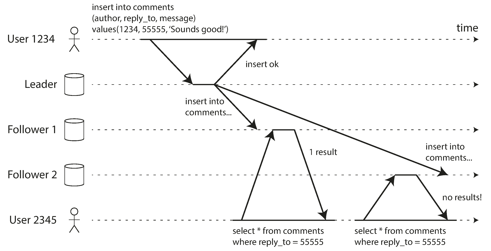
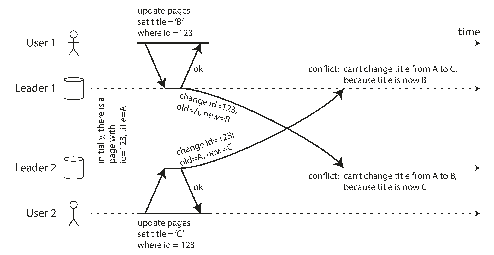

## Chapter-5 Replication

#### Why do you need replication?

1. Availability - If one database goes offline, we can continue to operate with other replicas.
2. Durability - We should never ever lose the date, If database goes offline or gets corrupted, we have the copies of
   them to restore from.
3. Latency - Closer the database to the user location, lesser the latency.
4. Scalability - To handle high load from users, load is distributed to multiple database servers.

#### Replication vs Partitions:

1. Replication is just a copy of your database (replicas), both main database and the replicas will eventually have the
   same data.
2. Partitions is data saved in multiple database (shards). The data is distributed across multiple databases and any
   queries are going to search for all of them.

### Replication In depth

#### We are going to go in depth on all the below replication topics.

1. Single Leader Replication
    1. Synchronous vs Asynchronous replication
    2. Handling Nodes (replicas)
        1. Setting up a new follower
        2. Follower Failure
        3. Leader Failure
    3. Methods of replicating data
        1. Statement based replication
        2. WAL based replication
        3. Logical (row-based) replication
        4. Trigger based replication
    4. Problems with replication Lag
        1. Read your own writes
        2. Monotonic Reads
        3. Consistent Prefix Reads
2. Multi Leader Replication
    1. Use cases
        1. Multi datacenter operation
        2. Offline Operations
        3. Collaborative Editing
    2. Handling Write Conflicts
    3. Replication Topologies
3. Leaderless Replication
    1. Synchronizing nodes (read repair and anti-entropy)
    2. Quorums of reading and writing
    3. Limitations of Quorum consistency
    4. Sloppy Quorums and Hinted Handoff

#### Synchronous vs Asynchronous Replication

Replication usually follows leader-follower strategy, where in there will be only one database that take in writes but
multiple replicas that takes in reads.  
Data from the leader database is replicated to the followers either synchronously or asynchronously.

Synchronous replication is when you return success to a write request only when the data is replicated to it's
followers. This is useful when your system needs strong consistency, however this is not a optimal approach because the
response from replicas can be delayed for many reasons like network lags, network outages, replicas going down etc.. So
most systems use asynchronous replication.

Asynchronous replication is when you return success to the write request when you write the leader database and the data
is replicated eventually (the time depends on many factors mentioned above). However, there are many mechanisms
developed to
handle the stale reads, making it look like a strong consistency system.

Hybrid approach, also called as semi-synchronous. Data is replicated at least on other replica before returning
success. This approach makes sure that there is at least one other replica that is up to date with leader, and in
scenarios when leader goes down we don't actually lose any data.

Below image shows, leader based replication with one synchronous and one asynchronous replication.


#### Handling Nodes (replicas)

1. Setting up new Follower
    1. You make frequent snapshots of leader database.
    2. When a new follower is created, create it off of the latest snapshot.
    3. Request the leader for all the data changes since the snapshot.
        1. This requires the leader to maintain a WAL or similar to keep track of all the transactions.
2. Follower Failure
    1. If a follower goes down, it follows the similar approach as above.
    2. Once the follower is back online, it requests for all the data changes since it's last update.
3. Leader Failure
    1. If a leader fails, one of its followers takes the leader positions and accepts writes.
    2. Choosing which follower to take over is done is few different ways
        1. Choose the follower that has the most up-to-date information, i.e. latest data from leader.
    3. Issues when a leader is down
        1. Data can be lost. If a leader goes down with out replicating the latest data, then that data is lost. To
           avoid this a WAL is maintained, i.e. for every write, the database updates the sequence of steps it takes to
           process the write request before it does it. This makes sure that, even if the db is down it can read from
           the WAL
           and recover the data.
        2. Leaders conflict, it is possible that when the leader comes online, it still thinks that it is still the
           leader and starts accepting writes, whereas a new leader had already taken its place. This scenario is called
           split brain. To avoid this, some systems shut down one leader if two leaders are detected.

#### Methods of replicating data

Let's discuss more internals of how the replication is done. Below are few different ways.

1. Statement based replication
    1. This is the easiest way to replicate the data, just pass on the SQL statements received to the leader.
    2. However, there are downsides it
        1. Some functions like data() will result in different output in leader and replicas, causing data
           inconsistencies.
2. WAL based replication
    1. WAL (Write Ahead Log), logs the sequence of steps it is going to do before a write, its going to log the memory
       location in which it's going to modify the data.
    2. This seems useful, but if in case you have different database for replicas (i.e. postgres for leader and mysql
       for replicas), This information cannot be used. Also if you do any upgrades to your hardware, this information
       does not make much sense too.
3. Logical (row-based) replication
    1. This is the most common one, the leader replicates based on the rows. It passes in table name, column names and
       the new values it's going to add/update. This can be parsed irrespective of the database system or the hardware.
4. Trigger Based replication
    1. This is less common but exist, instead of databases dealing with replication, we let the code/application deal
       it.
    2. We use Triggers and Stored procedures to drive the replication.
    3. This is very risky, as there could be many failures that can happen, making the data inconsistent.

#### Problems with replication lag

What happens if the replication is delayed or one replica get the information but the other get it much later. How are
data inconsistencies dealt.

1. Reading your own writes
    1. Most applications give the option of seeing the information you have updated immediately after you have updated.
       For example, updating your profile status. You see it immediately after you update it.
    2. It is possible that after your write to the leader database, the next read happened from a replica that have not
       received the updates yet. This would result in bad user experience, as he just updated his status and he cannot
       see it change.
    3. Below are few approaches to handle such scenarios, also called as read-your-writes consistency
        1. If a write happens for a particular user, the subsequent reads are routed to the leader
           for some time (until all the nodes are replicated). Now this requires that the application keeps track of
           when the last update was made for the user.
        2. You can also forward this read request to only the replicas that has been updated after the users last
           updated timestamp. This ensures the replica has the updates made by the user.
    4. This gets more tricky for scenarios when user is logged in from multiple devices. If the update happens on one
       device it should also be reflected on the other device as well. For this to happen, the application should keep
       the users last updated timestamp in a central location.
    5. Below image shows a user makes a write, followed by a read from a stale replica. To prevent this anomaly, we need
       read-after-write consistency.
       
2. Monotonic Reads
    1. Lets assume you are reading comments on a post and there is new reply, Initially you see the reply, but on
       refresh you read from stale replica, now the message disappears. This is like moving backward in time.
    2. Monotonic reads is a guarantee that you will not see conflicting information. That you will not go backward in
       time.
    3. To achieve this, a user is always redirected to one replica, so the information he sees is always consistent. You
       can use user-id to hash it and get the replica number he is supposed to use.
    4. Below image shows a user first reads from fresh replica, then from a stale replica. Time appears to go backward.
       To prevent this anomaly, we need monotonic reads.
       
3. Consistent Prefix Reads
    1. This is more related to partitions than replicas, more on this in partitions.
    2. An overview, Assume a conversation where user1 replies to user2's message and user3 is reading them from the
       group.
       ```text
              user1: when is the program starting  
              user2: 10:15 am  
        ```
    3. Assume if user1's messages goes to partition1 and user2's messages goes to partition2 and the replication lag
       happens. It is possible that user3 is seeing the message is reverse order.
        1. Below images shows, if some partitions are replicated slower than others, an observer may see the answer
           before they see the question.
           
    4. To prevent this requires another type of guarentee called "Consistent prefix reads". This guarantee says that if
       a sequence of writes happens in a certain order, the anyone reading those will see them in the same order.
    5. One solution is to make sure that any writes that are causally related to each other are written to the same
       partition.

#### Multi-Leader Replication:

In the above single leader replication model, the only downside is there is only one leader. Any failure to this leader
could potentially cause outages. The natural incline would be to have multiple such leaders to avoid downtime.  
However multi leader replication model is very dangerous and should be avoided if possible.

**Use cases:**

1. Multi Data center operations
    1. If you are operating in multiple data centers, you can have a leader in each datacenter, so if in any case the
       entire datacenter goes offline, you still take writes.
       
2. Clients with Offline Operation
    1. Consider your calendar app on your phone/tablet/laptop without internet, each one acts as a leader by taking
       writes from the user, and when its it online syncs up with the remote system.
3. Collaborative editing
    1. Real time collaborative editing allows multiple people to edit a document simultaneously, this is very similar to
       multi leader replication model. Changes are first saved to their local and asynchronously replicated to the
       server.

**Handling Write Conflicts**

The major issue with Multi Leader replication model is it's conflicts, this does not happen in single leader model, as
all the replicas follow the leader. But in this model, there are multiple leaders and each one takes in writes from user
but when replicating conflicts can be found with other data from other leaders.  
Take an example of wiki page that is simultaneously being edited by two users, User1 changes the title of the page from
A to B and user2 changes the title from A to C as the same time. Each user's change is successfully applied to their
local leader. However, when the changes are asynchronously replicated, a conflict is detected.



In scenarios like this, conflicts can be resolved in the below ways

1. Synchronous vs Asynchronous conflict detection
    1. It is possible that you can make the user wait until the write is successful on all leaders, but this defeats the
       purpose of having multiple leaders.
2. Conflict Avoidance
    1. You route all writes on a record to the same leader, avoiding conflicts all together.
    2. Downsides - if a leader is down or if a user moves to different location, you need to switch the leader, which
       again leads to initial problem of write conflicts.
3. Converging towards a consistent state
    1. The other approach is converging the records, either by last updated time stamp, or by having a unique id
       and choosing the highest value etc..
4. Custom Conflict resolution logic
    1. You can write custom application logic to handle conflicts, and the database will call this handler when a
       conflict is detected.
    2. You can also have the application logic pick up the conflicts when reading the data and let the users decide the
       value.

**Replication Topologies**   
Many different ways to replicate the data to other nodes

1. Circular topology and Star topology
    1. May need to pass many different nodes before reaching all replicas.
    2. A problem with circular and star topologies is that if just one node fails, it can interrupt
       the flow of replication messages between other nodes, causing them to be unable
       to communicate until the node is fixed
2. All-to-All topology (most common)
    1. Every node replicates to every node.


#### Leaderless Replication

This is also called dynamo-style replication, because dynamo started implementing this in the recent times.
In this approach, all nodes acts as both leaders and replicas. However,request both read and write, are not just sent to
one node, but they are sent to all nodes. But for every read/write to succeed multiple nodes must accept on a value
before returning success. This value is decided by Quorum

**What is Quorum**  
It refers to the minimum number of nodes that must agree to call an operation successful.  
Read Quorum (r) - Minimum number of nodes that must agree on a value before returning it.
Write Quorum (w)- Minimum number of nodes that must be successful with write before returning success.

For a consistent system, the w+r should be greater than the total number of nodes(w+r > n), this way there is at least
one
overlapping node that has the updated information.   
A common choice is to have w=r= (n+1)/2  (rounded up)

The Quorum condition w+r > n, allows the system to tolerate unavailable nodes as follows

1. If w<n, we can still process writes if a node is unavailable.
2. If r<n, we can still process reads if a node is unavailable.
3. With n=3, w=2, r=2 we can tolerate one unavailable node.
4. With n=5, w=3, r=3 we can tolerate two unavailable nodes.


**Read repair and anti-entropy**  
If a node is down, Other nodes keep processing the writes. But when this node is up, there are two ways in which the
data is synced.

1. Read Repair
    1. As the name suggests, when reading the data, if the db finds any inconsistencies in the data, it fixes it.
    2. However, you cannot completely rely on this approach, because this does not update the records that are not read,
       leaving the data inconsistent.
3. Anti Entropy
    4. Thi

## Chapter-6 Partitioning

For very large data sets, data is partitioned to many different nodes. Each node containing only a specific set of keys.
We will discuss more about partitioning techniques below

1. Partition by Key Range
2. Partition by Key Hash
    1. Consisting Hashing
3. Partition by Secondary Indexes
4. Balancing Partitions

### Range based Partitioning

Split based on range of keys manually.

Ex: all keys with in range a-d goes to partition 1
all keys with in range e-g goes to partition 2
all keys with in range h-m goes to partition 3
all keys with in range n-z goes to partition 4

The problem with the above approach is that there may be potential hotspots. It is possible that partition 1 has
the majority of the data compared to other partitions.

### Partition by key hash

This technique creates a hash out of the key and assigns them to the partition. Using consisting hashing model to make
sure the data is split across all partitions equally.

Downsides: Cannot query by key ranges.

### Partition by Secondary Indexes

This is in addition to the hashing. After the keys are split by their hash values, they are all sorted by the key name.
Below is an example of 3 partitions.


Downsides: Although, it takes only log(n) operations on each partition, you would still need to search all the
partitions to find a specific term.

#### Partition by global Secondary Index

To fix the above issue of querying all the partitions, you can maintain a global secondary indexes. Meaning, the
secondary index will not only have the indexes to current partition but also to records in other partitions too. And the
secondary indexes are also split across multiple partitions.


This approach is not advisable as adding/deleting a record will require all partitions to be updated and could lead to
inconsistent data in the events of network outages.

### References:

1. https://youtu.be/Bt8ZMC_Yuys?si=ERAUInXYgtd4hFuT