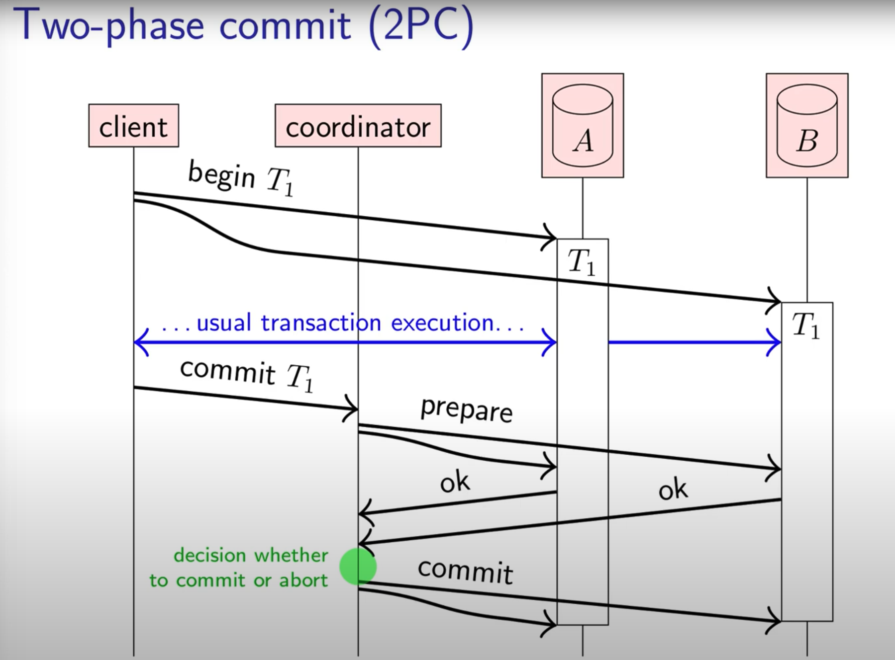
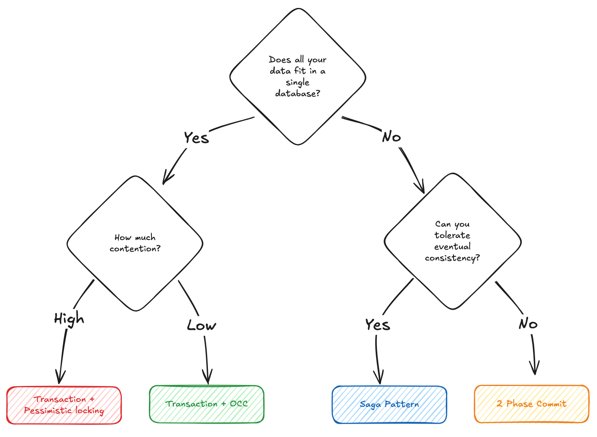

<!-- TOC -->
* [Single node database](#single-node-database)
  * [Race conditions](#race-conditions)
    * [Dirty Reads](#dirty-reads)
    * [Dirty Writes](#dirty-writes)
    * [Read Skew (non-repeatable reads)](#read-skew-non-repeatable-reads)
    * [Lost updates](#lost-updates)
    * [Write Skew](#write-skew)
    * [Phantom reads](#phantom-reads)
  * [Isolation Levels and the Race conditions it addresses](#isolation-levels-and-the-race-conditions-it-addresses)
  * [Achieving Stabilizability in single node databases](#achieving-stabilizability-in-single-node-databases)
    * [Literally Executing transactions in serial order](#literally-executing-transactions-in-serial-order)
    * [Pessimistic locking (ex : Two-phase locking (2PL))](#pessimistic-locking-ex--two-phase-locking-2pl)
    * [Optimistic Concurrency Control (ex: Serializable Snapshot Isolation)](#optimistic-concurrency-control-ex-serializable-snapshot-isolation)
* [Distributed databases](#distributed-databases)
  * [Two-Phase Commit (2PC)](#two-phase-commit-2pc)
    * [Distributed Locks](#distributed-locks)
      * [Redis with TTL](#redis-with-ttl)
      * [Database columns](#database-columns)
      * [ZooKeeper/etcd](#zookeeperetcd)
* [Choosing the Right Approach](#choosing-the-right-approach)
* [When to Use in Interviews](#when-to-use-in-interviews)
  * [Recognition Signals](#recognition-signals)
  * [Common Interview Scenarios](#common-interview-scenarios)
  * [When NOT to overcomplicate](#when-not-to-overcomplicate)
<!-- TOC -->

# Single node database

## Race conditions

### Dirty Reads

One client reads another client's writes before they have been committed.   
**READ_COMMITTED** isolation level and stronger levels prevent dirty reads.

### Dirty Writes

Once client overwrites data that another client has written, but not yet committed.  
Almost all transaction implementations prevent dirty writes.

### Read Skew (non-repeatable reads)

A client sees different parts of the database at different points in time. This issue is most commonly prevented with
**SNAPSHOT ISOLATION**, which allows a transaction to read from a consistent snapshot at one point in time. It is
usually
implemented with multi-version concurrency control (MVCC).

### Lost updates

Two clients concurrently perform a read-modify-write cycle. One overwrites the other's writes without incorporating its
changes, so data is lost. Some implementations of **SNAPSHOT ISOLATION** prevent this anomaly automatically, while other
require manual lock (SELECT FOR UPDATE)

### Write Skew

A transaction reads something, makes a decision based n the value it saw, and writes the decision to the database.
However, by the time write is made, the premise of the decision is no longer true. Only **SERIALIZABLE** isolation
prevents this anomaly.

### Phantom reads

A transaction reads objects that match some search condition. Another client makes a write that affects the results of
that search. **SNAPSHOT ISOLATION** prevents straight forward phantom reads, but phantoms in the context of write skew
require special treatment, such as index-range locks.

## Isolation Levels and the Race conditions it addresses

| Isolation Level                              | Prevents                                             | Still Allows                                                                  |
|----------------------------------------------|------------------------------------------------------|-------------------------------------------------------------------------------|
| **Read Uncommitted**                         | ❌ Prevents nothing                                   | Dirty Reads, Dirty Writes, Read Skew, Lost Updates, Write Skew, Phantom Reads |
| **Read Committed**                           | ✅ Dirty Reads, Dirty Writes                          | Read Skew, Lost Updates, Write Skew, Phantom Reads                            |
| **Repeatable Read** / **Snapshot Isolation** | ✅ Dirty Reads, Dirty Writes, Read Skew, Lost Updates | Write Skew, Phantom Reads                                                     |
| **Serializable**                             | ✅ Prevents *all* anomalies                           | —                                                                             |

## Achieving Stabilizability in single node databases

### Literally Executing transactions in serial order

If you can make each transaction very fast to execute, and the transaction throughput is low engough to processso n a
single CPU core, this is a simple and effective option.

### Pessimistic locking (ex : Two-phase locking (2PL))

Pessimistic Locking prevents conflicts by acquiring locks upfront. The name comes from being "pessimistic" about
conflicts - assuming they will happen and preventing them.

```
BEGIN TRANSACTION;

-- Lock the row first to prevent race conditions
SELECT available_seats FROM concerts
WHERE concert_id = 'weeknd_tour'
FOR UPDATE;

-- Now safely update the seat count
UPDATE concerts
SET available_seats = available_seats - 1
WHERE concert_id = 'weeknd_tour'

-- Create the ticket record
INSERT INTO tickets (user_id, concert_id, seat_number, purchase_time)
VALUES ('user123', 'weeknd_tour', 'A15', NOW());

COMMIT;
```

The FOR UPDATE clause acquires an exclusive lock on the concert row before reading. When Alice runs this code, Bob's
identical transaction will block at the SELECT statement until Alice's transaction completes. This prevents both from
seeing the same initial seat count and ensures only one person can check and update at a time.
A lock in this context is a mechanism that prevents other database connections from accessing the same data until the
lock is released. Databases like PostgreSQL and MySQL are multi-threaded systems that can handle thousands of concurrent
connections, but locks ensure that only one connection can modify a specific row (or set of rows) at a time.

Explicit Row Locks
Performance considerations are really important when using locks. You want to lock as few rows as possible for as short
a time as possible. Lock entire tables and you kill concurrency. Hold locks for seconds instead of milliseconds and you
create bottlenecks. In our example, we're only locking one specific concert row briefly during the purchase.

### Optimistic Concurrency Control (ex: Serializable Snapshot Isolation)

Pessimistic locking assumes conflicts will happen and prevents them upfront. Optimistic concurrency control (OCC) takes
the opposite approach in that it assumes conflicts are rare and detects them after they occur.
The performance benefit is significant. Instead of blocking transactions waiting for locks, you let them all proceed and
only retry the ones that conflict. Under low contention, this eliminates locking overhead entirely.
The pattern is simple, you can include a version number with your data. Every time you update a record, increment the
version. When updating, specify both the new value and the expected current version.

-- Alice reads: concert has 1 seat, version 42
-- Bob reads: concert has 1 seat, version 42

-- Alice tries to update first:

```
BEGIN TRANSACTION;
UPDATE concerts
SET available_seats = available_seats - 1, version = version + 1
WHERE concert_id = 'weeknd_tour'
AND version = 42; -- Expected version

INSERT INTO tickets (user_id, concert_id, seat_number, purchase_time)
VALUES ('alice', 'weeknd_tour', 'A15', NOW());
COMMIT;
```

-- Alice's update succeeds, seats = 0, version = 43

-- Bob tries to update:

```
BEGIN TRANSACTION;
UPDATE concerts
SET available_seats = available_seats - 1, version = version + 1
WHERE concert_id = 'weeknd_tour'
AND version = 42; -- Stale version!
```

-- Bob's update affects 0 rows - conflict detected, transaction rolls back
When Bob's update fails, he knows someone else modified the record. He can re-read the current state, check if seats are
still available, and retry with the new version number. If seats are gone, he gets a clear "sold out" message instead of
a mysterious failure.
Importantly, the "version" doesn't have to be a separate column. You can use existing data that naturally changes when
the record is updated. In our concert example, the available seats count itself serves as the version. Here's how it
works:
-- Alice reads: 1 seat available
-- Bob reads: 1 seat available

-- Alice tries to update first:

```
BEGIN TRANSACTION;
UPDATE concerts
SET available_seats = available_seats - 1
WHERE concert_id = 'weeknd_tour'
AND available_seats = 1; -- Expected current value

INSERT INTO tickets (user_id, concert_id, seat_number, purchase_time)
VALUES ('alice', 'weeknd_tour', 'A15', NOW());
COMMIT;
```

-- Alice's update succeeds, seats now = 0

-- Bob tries to update:

```
BEGIN TRANSACTION;
UPDATE concerts
SET available_seats = available_seats - 1
WHERE concert_id = 'weeknd_tour'
AND available_seats = 1; -- Stale value!
```

-- Bob's update affects 0 rows - conflict detected, transaction rolls back

This approach works because we're checking that the current seat count matches what we read earlier. If someone else
bought the ticket first, the seat count changed and our update fails.
The same pattern applies to other scenarios. For eBay bidding, use the current highest bid amount as the version. For
bank transfers, use the account balance. For inventory systems, use the stock count. Any value that changes when the
record is updated can serve as your optimistic concurrency control mechanism.

This approach makes sense when conflicts are uncommon. For most e-commerce scenarios, the chance of two people buying
the exact same item at the exact same moment is low. The occasional retry is worth avoiding the overhead of pessimistic
locking.

# Distributed databases

All the approaches we've covered so far work within a single database. But what happens when you need to coordinate
updates across multiple databases? This is where things get significantly more complex.
If you identify that your system needs strong consistency guarantees during high-contention scenarios, you should do all
you can to keep the relevant data in a single database. Nine times out of ten, this is entirely possible and avoids the
need for distributed coordination, which can get ugly fast.
Consider a bank transfer where Alice and Bob have accounts in different databases. Maybe your bank grew large enough
that you had to shard user accounts across multiple databases. Alice's account lives in Database A while Bob's account
lives in Database B. Now you can't use a single database transaction to handle the transfer. Database A needs to debit
$100 from Alice's account while Database B needs to credit $100 to Bob's account. Both operations must succeed or both
must fail. If Database A debits Alice but Database B fails to credit Bob, money disappears from the system.
You have several options for distributed coordination, each with different trade-offs:

## Two-Phase Commit (2PC)

The classic solution is two-phase commit, where your transfer service acts as the coordinator managing the transaction
across multiple database participants. The coordinator (your service) asks all participants to prepare the transaction
in the first phase, then tells them to commit or abort in the second phase based on whether everyone successfully
prepared.

Critically, the coordinator must write to a persistent log before sending any commit or abort decisions. This log
records which participants are involved and the current state of the transaction. Without this log, coordinator crashes
create unrecoverable situations where participants don't know whether to commit or abort their prepared transactions.
Keeping transactions open across network calls is extremely dangerous. Those open transactions hold locks on Alice's and
Bob's account rows, blocking any other operations on those accounts. If your coordinator service crashes, those
transactions stay open indefinitely, potentially locking the accounts forever. Production systems add timeouts to
automatically rollback prepared transactions after 30-60 seconds, but this creates other problems like legitimate slow
operations might get rolled back, causing the transfer to fail even when it should have succeeded.
The prepare phase is where each database does all the work except the final commit. Database A starts a transaction,
verifies Alice has sufficient funds, places a hold on $100, but doesn't commit yet. The changes are made but not
permanent, and other transactions can't see them. Database B starts a transaction, verifies Bob's account exists,
prepares to add $100, but doesn't commit yet.

If both databases can prepare successfully, your service tells them to commit their open transactions. If either fails,
both roll back their open transactions. Two-phase commit guarantees atomicity across multiple systems, but it's
expensive and fragile. If your service crashes between prepare and commit, both databases are left with open
transactions in an uncertain state. If any database is slow or unavailable, the entire transfer blocks. Network
partitions can leave the system in an inconsistent state.



### Distributed Locks

For simpler coordination needs, you can use distributed locks. Instead of coordinating complex transactions, you just
ensure only one process can work on a particular resource at a time across your entire system.
For our bank transfer, you could acquire locks on both Alice's and Bob's account IDs before starting any operations.
This prevents concurrent transfers from interfering with each other:
Distributed locks can be implemented with several technologies, each with different characteristics:

#### Redis with TTL

Redis provides atomic operations with automatic expiration, making it ideal for distributed locks. The
SET command with expiration atomically creates a lock that Redis will automatically remove after the TTL expires. This
eliminates the need for cleanup jobs since Redis handles expiration in the background. The lock is distributed because
all your application servers can access the same Redis instance and see consistent state. When the lock expires or is
explicitly deleted, the resource becomes available again. The advantage is speed and simplicity. Redis operations are
very fast and the TTL handles cleanup automatically. The disadvantage is that Redis becomes a single point of failure,
and you need to handle scenarios where Redis is unavailable.

#### Database columns

You can implement distributed locks using your existing database by adding status and expiration
columns to track which resources are locked. This approach keeps everything in one place and leverages your database's
ACID properties to ensure atomicity when acquiring locks. A background job periodically cleans up expired locks, though
you need to handle race conditions between the cleanup job and users trying to extend their locks. The advantage is
consistency with your existing data and no additional infrastructure. The disadvantage is that database operations are
slower than cache operations, and you need to implement and maintain cleanup logic.

#### ZooKeeper/etcd

These are purpose-built coordination services designed specifically for distributed systems. They
provide strong consistency guarantees even during network partitions and leader failures. ZooKeeper uses ephemeral nodes
that automatically disappear when the client session ends, providing natural cleanup for crashed processes. Both systems
use consensus algorithms (Raft for etcd, ZAB for ZooKeeper) to maintain consistency across multiple nodes.
The advantage is robustness. These systems are designed to handle the complex failure scenarios that Redis and database
approaches struggle with. The disadvantage is operational complexity, as you need to run and maintain a separate
coordination cluster.

Distributed locks aren't just for technical coordination either, they can dramatically improve user experience by
preventing contention before it happens. Instead of letting users compete for the same resource, create intermediate
states that give temporary exclusive access.
Consider Ticketmaster seat reservations. When you select a seat, it doesn't immediately go from "available" to "sold."
Instead, it goes to a "reserved" state that gives you time to complete payment while preventing others from selecting
the same seat. The contention window shrinks from the entire purchase process (5 minutes) to just the reservation step (
milliseconds).
The same pattern appears everywhere. Uber sets driver status to "pending_request," e-commerce sites put items "on hold"
in shopping carts, and meeting room booking systems create temporary holds.
The advantage is simplicity compared to complex transaction coordination. The disadvantage is that distributed locks can
become bottlenecks under high contention, and you need to handle lock timeouts and failure scenarios.

# Choosing the Right Approach

**Can you keep all the contended data in a single database?** If yes, use pessimistic locking or optimistic concurrency
based on your conflict frequency.  
**Single database, high contention:** Pessimistic locking with explicit locks (FOR UPDATE). This provides predictable
performance, is simple to reason about, and handles worst-case scenarios well.  
**Single database, low contention:** Optimistic concurrency control using existing columns as versions. This provides
better performance when conflicts are rare and has no blocking.  
**Multiple databases, must be atomic:** Distributed transactions (2PC for strong consistency, Sagas for resilience). Use
only when you absolutely need atomicity across systems.  
**User experience matters:** Distributed locks with reservations to prevent users from entering contention scenarios.
This is great for ticketing, e-commerce, and any user-facing competitive flows.

| Approach                                | Use When                                                         | Avoid When                                           | Typical Latency                      | Complexity |
|-----------------------------------------|------------------------------------------------------------------|------------------------------------------------------|--------------------------------------|------------|
| **Pessimistic Locking**                 | High contention, critical consistency, single database           | Low contention, high throughput needs                | Low (single DB query)                | Low        |
| **SERIALIZABLE Isolation**              | Need automatic conflict detection, can’t identify specific locks | Performance critical, high contention                | Medium (conflict detection overhead) | Low        |
| **Optimistic Concurrency (OCC)**        | Low contention, high read/write ratio, performance critical      | High contention, can’t tolerate retries              | Low (when no conflicts)              | Medium     |
| **Distributed Transactions (2PC / XA)** | Must have atomicity across multiple systems, tolerate complexity | High availability requirements, performance critical | High (network coordination)          | Very High  |
| **Distributed Locks**                   | User-facing flows (reservations, uniqueness), simpler than 2PC   | Purely technical coordination with no alternatives   | Low (simple status updates)          | Medium     |



# When to Use in Interviews

Don't wait for the interviewer to ask about contention. Be proactive in recognizing scenarios where multiple processes
might compete for the same resource and suggest appropriate coordination mechanisms. This is typically when you
determine during your non-functional requirements that your system requires strong consistency.

## Recognition Signals

Here are some bang on examples of when you might need to use contention patterns:

1. Multiple users competing for limited resources such as concert tickets, auction bidding, flash sale inventory, or
   matching drivers with riders
2. Prevent double-booking or double-charging in scenarios like payment processing, seat reservations, or meeting room
   scheduling
3. Ensure data consistency under high concurrency for operations like account balance updates, inventory management, or
   collaborative editing
4. Handle race conditions in distributed systems in any scenario where the same operation might happen simultaneously
   across multiple servers and where the outcome is sensitive to the order of operations.

## Common Interview Scenarios

This shows up A LOT in common interview questions. It's one of the most popular patterns and interviewers love to ask
about it. Here are some examples of places where you might need to use contention patterns:

1. Online Auction Systems - Perfect for demonstrating optimistic concurrency control because multiple bidders compete
   for the same item. You can use the current high bid as the "version" and only accept new bids if they're higher than
   the expected current bid. Application-level status coordination also helps by marking items as "bidding ends in 30
   seconds" to prevent last-second contention scenarios.
2. Ticketmaster/Event Booking - While this seems like a classic pessimistic locking scenario for seat selection,
   application-level status coordination is actually the bigger win. When users select seats, you immediately reserve
   them with a 10-minute expiration, which prevents the terrible UX of users filling out payment info only to find the
   seat was taken by someone else.
3. Banking/Payment Systems - Great place to showcase distributed transactions since account transfers between different
   banks or services need atomic operations across multiple systems. You should start with saga pattern for resilience
   and mention 2PC only if the interviewer pushes for strict consistency requirements.
4. Ride Sharing Dispatch - Application-level status coordination shines here because you can set driver status to "
   pending_request" when sending ride requests, which prevents multiple simultaneous requests to the same driver. You
   can use either caches with TTL for automatic cleanup when drivers don't respond within 10 seconds, or database status
   fields with periodic cleanup jobs.
5. Flash Sale/Inventory Systems - Perfect for demonstrating a mix of approaches. You can use optimistic concurrency for
   inventory updates with the current stock count as your version, but you should also implement application-level
   coordination for shopping cart "holds" to improve user experience and reduce contention at checkout.
6. Yelp/Review Systems - Great example of optimistic concurrency control because when users submit reviews, you need to
   update the business's average rating. Multiple concurrent reviews for the same restaurant create contention, so you
   can use the current rating and review count as your "version" and only update if they match what you read initially.
   This prevents rating calculations from getting corrupted when reviews arrive simultaneously. The best candidates
   identify contention problems before they're asked. When designing any system with shared resources, immediately
   address coordination:
   "This auction system will have multiple bidders competing for items, so I'll use optimistic concurrency control with
   the current high bid as my version check."
   "For the ticketing system, I want to avoid users losing seats after filling out payment info, so I'll implement seat
   reservations with a 10-minute timeout."
   "Since we're sharding user accounts across databases, transfers between different shards will need distributed
   transactions. I'll use the saga pattern for resilience."

## When NOT to overcomplicate

Don't reach for complex coordination mechanisms when simpler solutions work.

1. Low contention scenarios where conflicts are rare (like updating product descriptions where only admins can edit) can
   use basic optimistic concurrency with retry logic. Don't implement elaborate locking schemes when simple retry logic
   handles the occasional conflict.
2. Single-user operations like personal todo lists, private documents, or user preferences have no contention, so no
   coordination is needed.
3. Read-heavy workloads where most operations are reads with occasional writes can use simple optimistic concurrency to
   handle the rare write conflicts without impacting read performance.