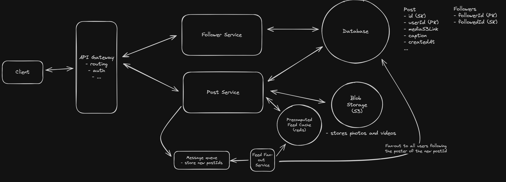

This pattern is primarily used in social media apps like (instagram, twitter, facebook) where pre-computing is needed
for every user. Since querying database everytime a user requests for feed is an expensive operation, we compute the
feed beforehand and store in cache

### How do you precompute the feed (fanout on write)

Instead of generating the feed when the user requests it (fan-out on read), we generate it when a user posts (fan-out on
write). When a user creates a new post, we get all users who follow the posting user. For each follower, we prepend the
new postId to their precomputed feed. This precomputed feed can be stored in a dedicated Feeds table (in DynamoDB, for
example) or in a cache like Redis (store each user's feed as a sorted set in redis).

When a user requests their feed, we read the top N posts from their sorted set in Redis, which is a single, fast
operation. However, we still need to hydrate the posts based on these postIds.   
To do this we have 3 options:

1. For each postId in the cache, go fetch the metadata from the Posts table in DynamoDB. This is simple but requires an
   additional database query for every feed request.
2. Rather than caching the postId, we could cache the entire post data in Redis. This way we don't have to make a
   second query to the Posts table to get the post metadata. This is faster but uses more memory and introduces data
   consistency challenges.
3. Use a hybrid approach with two Redis data structures, one for the feed's postIds and another for a post data. So when
   fetching feeds for a user, we get all the postIds (from postIds DS) and hydrate them with post data(from post data
   DS). This will save us the additional query to the DB. So when an user writes a post we need to update both the DB
   and the post data cache.

### Celebrity problem

This 'fanout on write' approach significantly improves read performance, making feed retrieval a fast, single Redis
query. However, we've traded read-time complexity for write-time complexity and increased storage. The primary challenge
is write amplification, especially the 'celebrity problem'. A single post by a user with millions of followers triggers
millions of writes to Redis, potentially overwhelming our system and increasing write latency for popular users. This is
because we need to update the feed cache for the millions of people following them.

We can address the main limitation of the precompute approach, that celebrities will result in massive write
amplification, by using a hybrid approach. We combine fanout-on-write for most users with fanout-on-read for popular
accounts. This provides a good balance: fast reads for most users and manageable write amplification.    

#### Here's how it works: 
We define a threshold for the number of followers. Let's say, 100,000 followers. For users with
fewer than 100,000 followers, we precompute their followers' feeds just like in the "good" approach above. For users
with more than 100,000 followers (the "celebrities"), we DON'T precompute their posts into their followers' feeds.  

#### Instead:
When a "celebrity" posts, we add the post to the Posts table and do not trigger an asynchronous feed update for their
followers. When a user requests their feed: We fetch the precomputed portion of their feed from Redis (posts from users
with <100,000 followers). Then, we also query the Posts table for recent posts from the "celebrities" they follow. We
then merge the precomputed feed with the recent posts from celebrities, chronologically and return the merged feed.
Thus, we end up with an effective mix between pre-computation and real-time merging.  
 

Fanout-on-write for the majority of users (follower count < 100,000)    
Fanout-on-read for the few "celebrity" users (follower count > 100,000)
 

### Where is this pattern used:
This pattern is used in most of the social media applications like instagram, twitter, facebook etc.. 