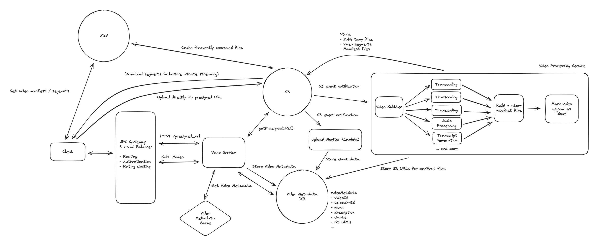

<!-- TOC -->
    * [Uploading files](#uploading-files)
      * [S3 pre-signed URL's](#s3-pre-signed-urls)
    * [Downloading files](#downloading-files)
    * [Use cases](#use-cases)
      * [YouTube / Netflix](#youtube--netflix)
    * [Non-Functional Requirements on File storage](#non-functional-requirements-on-file-storage)
      * [1. The system should support resumable uploads](#1-the-system-should-support-resumable-uploads)
      * [2. The system should handle processing a video to support adaptive bitrate streaming](#2-the-system-should-handle-processing-a-video-to-support-adaptive-bitrate-streaming)
      * [3. The system should make uploads, downloads, and syncing as fast as possible](#3-the-system-should-make-uploads-downloads-and-syncing-as-fast-as-possible)
<!-- TOC -->

This document explains in detail on how to deal with large file storage used in applications like

1. Dropbox / Google Drive
2. YouTube / Netflix

If the system design question involves storing large files, like images, videos, documents, you typically cannot do that
in a database. You would need a dedicated file storage system like Amazon S3. For videos, it can go one step further to
store the file in chunks.

### Uploading files

We typically assume that user sends the video to your service and your service uploads to S3. But there
is a major bottleneck here, API GW. The payload size limit for API Gateway is 10 MB for both request and response. So
you would have to chuck
the videos into size <10MB. But this still is little redundant, since the upload happens twice, once when user
uploads to the service, and the service uploads to S3.

#### S3 pre-signed URL's

The standard practice is to upload the files/videos directly to S3.   
Below is the flow

1. User sends a file upload request to your service, with the metadata of the file.
    1. This request typically contains metadata of the file like video type, size and the number of chunks to upload
       etc..
2. The Service requests S3 to generate a bunch of pre-signed url's, these url's are configured
    1. To accept only the particular file type and HTTP method.
    2. To take in the users security creds.
    3. To expire after a preset time.
3. Service will respond the initial request with these pre-signed URL's.
4. User uploads the videos directly to S3, via the pre-signed URL's.
5. S3 does a callback to our service after user uploads the file, so we can verify that the upload is complete for each
   chunk.
    1. We should not trust the user to tell us the upload is complete, we should verify with S3 directly.

### Downloading files

The same thing goes for downloading files as well, you directly download the file from S3 or from CDN (if its frequently
downloaded file)

1. User sends in a request to download a file.
2. The service responds back with an authenticated S3 url.
3. User downloads the file directly from S3.

### Use cases

#### YouTube / Netflix

1. User uploads the video via the pre-signed url's.
2. The service will convert the uploaded file to many different formats and resolutions.
    1. If the user uploads the video in mp4 format and 4K quality, The service will trigger an async process to convert
       the video into many formats like MOV, WMV, MKV etc. and into many resolution like 1080p, 720p, 480p etc. These
       formats and resolutions are used based on the device used network quality.
3. When downloading the video, user downloads the video in multiple chunks sequentially.

### Non-Functional Requirements on File storage

#### 1. The system should support resumable uploads

In order to support resumable uploads for larger videos, we'll need to consider how we'll track progress for the video
upload flow. This refers to tracking progress of the original upload.

1. The client would divide the video file into chunks, each with a fingerprint hash. A chunk would be small, ~5-10MB in
   size.
2. VideoMetadata would have a field called chunks which would be a list of chunk JSONs, each with fingerprint and status
   field.
3. The client would POST request to the backend to update the VideoMetadata with the list of chunks, each with status
   NotUploaded.
4. The client would upload each chunk to S3.
5. S3 would fire S3 event notifications to an AWS Lambda that would update the VideoMetadata by marking the chunk (
   identified by its fingerprint) as Uploaded.
6. If the client stopped uploading, it could resume by fetching the VideoMetadata to see the uploaded chunks and to skip
   chunks that had been uploaded already.

#### 2. The system should handle processing a video to support adaptive bitrate streaming

In order to support smooth video playback, we need to support adaptive bitrate streaming, so the client can
incrementally download segments of videos with varying formats to adapt to fluctuating network conditions.

When a video is uploaded in its original format, it needs to be post-processed to make it available as a streamable
video to a wide range of devices. As indicated previously, post-processing a video ends up being a "pipeline". The
output of this pipeline is:

1. Video segment files in different formats (codec and container combinations) stored in S3.
2. Manifest files (a primary manifest file and several media manifest files) stored in S3. The media manifest files will
   reference segment files in S3.

In order to generate the segments and manifest files, the stepwise order of operations will be:

1. Split up the original file into segments (using a tool like ffmpeg or similar). These segments will be transcoded (
   converted from one encoding to another) and used to generated different video containers.
2. Transcode (convert from one encoding to another) each segment and process other aspects of the segments (audio,
   transcript generation).
3. Create manifest files referencing the different segments in different video formats.
4. Mark the upload as "complete".

#### 3. The system should make uploads, downloads, and syncing as fast as possible

1. For download, we can use a CDN to cache the file closer to the user. This made it so that the file doesn't have to
   travel as far to get to the user, reducing latency and speeding up download times.
2. For upload, chunking, beyond being useful for resumable uploads, also plays a significant role in speeding up the
   upload process. While bandwidth is fixed (put another way, the pipe is only so big), we can use chunking to make the
   most of the bandwidth we have. By sending multiple chunks in parallel, and utilizing adaptive chunk sizes based on
   network conditions, we can maximize the use of available bandwidth.
3. The same chunking approach can be used for syncing files - when a file changes, we can identify which chunks have
   changed and only sync those chunks rather than the entire file, making syncing much faster.
4. We can also utilize compression to speed up both uploads and downloads. Compression reduces the size of the file,
   which means fewer bytes need to be transferred. We can compress a file on the client before uploading it and then
   decompress it on the server after it's uploaded. We can also compress the file on the server before sending it to the
   client and then rely on the client to decompress it. We'll need to be smart about when we compress though.
   Compression is only useful if the speed gained from transferring fewer bytes outweighs the time it takes to compress
   and decompress the file. For some file types, particularly media files like images and videos, the compression ratio
   is so low that it's not worth the time it takes to compress and decompress the file. If you take a .png off your
   computer right now and compress it, you'll be lucky to have decreased the file size by more than a few percent -- so
   it's not worth it. For text files, on the other hand, the compression ratio is much higher and, depending on network
   conditions, it may very well be worth it. A 5GB text file could compress down to 1GB or even less depending on the
   content. In the end, you'll want to implement logic on the client that decides whether to compress the file before
   uploading it based on the file type, size, and network conditions.