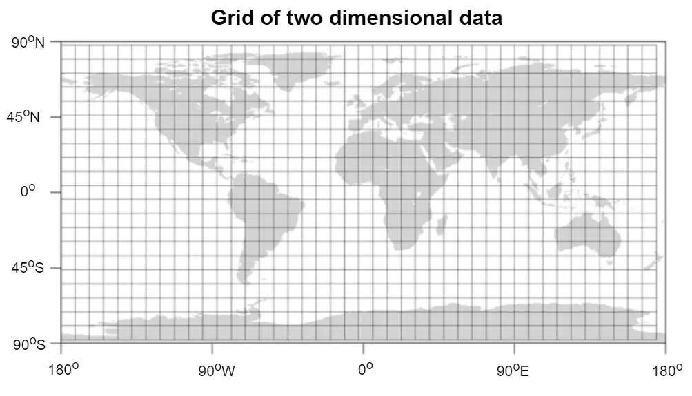
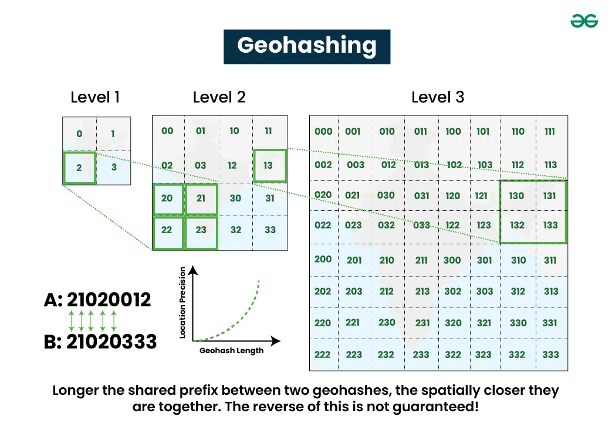
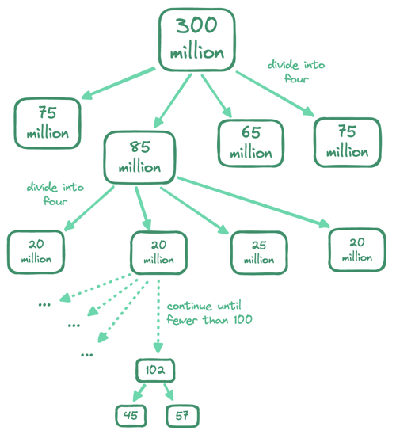
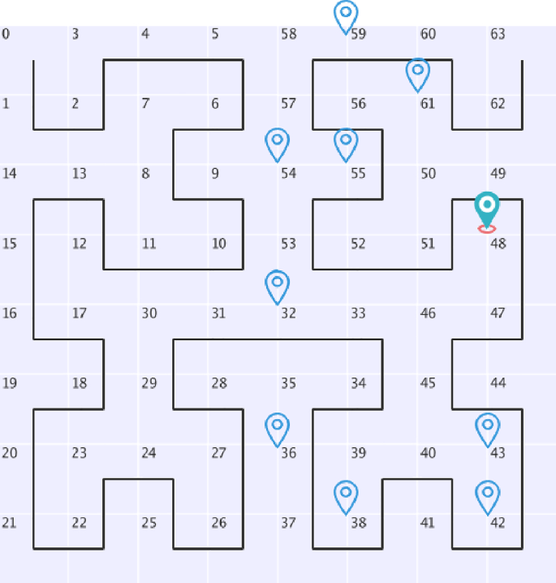

<!-- TOC -->
  * [Proximity Pattern:](#proximity-pattern)
  * [How do we find the nearest entities for a location?](#how-do-we-find-the-nearest-entities-for-a-location)
    * [Query based on longitude and latitude (2-dimensional)](#query-based-on-longitude-and-latitude-2-dimensional)
    * [Types of Geo Spacial Indexes](#types-of-geo-spacial-indexes)
    * [Geo Hashing](#geo-hashing)
      * [Boundary Issue:](#boundary-issue)
      * [Not enough dataset in the geo hash:](#not-enough-dataset-in-the-geo-hash)
    * [Quad Tree:](#quad-tree)
      * [How to get nearby businesses with quadtree:](#how-to-get-nearby-businesses-with-quadtree)
      * [Use cases of Quadtree](#use-cases-of-quadtree)
    * [Google S2:](#google-s2)
  * [Realworld implementation of Geo Hashing:](#realworld-implementation-of-geo-hashing)
      * [Advantages of Redis](#advantages-of-redis)
  * [Use cases](#use-cases)
    * [Uber](#uber)
      * [Flow:](#flow)
      * [Common Non-Functional requirements and their solutions:](#common-non-functional-requirements-and-their-solutions)
    * [Yelp](#yelp)
      * [Flow](#flow-1)
      * [Common Non-Functional requirements and their solutions:](#common-non-functional-requirements-and-their-solutions-1)
    * [Find Friends](#find-friends)
      * [Flow](#flow-2)
      * [Common Non-Functional requirements and their solutions:](#common-non-functional-requirements-and-their-solutions-2)
    * [Local Delivery Application](#local-delivery-application)
      * [Flow](#flow-3)
      * [Common Non-Functional requirements and their solutions:](#common-non-functional-requirements-and-their-solutions-3)
  * [References:](#references)
      * [Geo Hashing:](#geo-hashing-1)
      * [Redis:](#redis)
<!-- TOC -->

## Proximity Pattern:

This document explains in detail on how to deal with location based services like

1. Uber
2. Yelp
3. Find Friends
4. Food Delivery app etc..

All the above applications has one thing in common, they want to find the nearest entities (restaurants, drivers,
friends...) for a
given location

1. **Uber :** Find the nearest drivers from the users location.
2. **Yelp :** Find the nearest destinations for the client entered location.
3. **Find Friends :** Find the nearest friends from the user location.
4. **Food Delivery app :** Find the nearest delivery persons from the restaurant.

## How do we find the nearest entities for a location?

Assuming, you know the latitude and longitude of the entities (drivers/restaurants/friends), how do you know if they are
near or far from a given location?

### Query based on longitude and latitude (2-dimensional)

Example: Clients location is 20.4 long and 58.4 lat.

Dividing the entire globe into a grid, To query the nearest long and lat, you would need to query the entire database
first on longitude and filter the results again with latitude.
This is very inefficient, because even if you get all the nearest longitudes, you still need to filter latitudes
equivalent to an entire width of the globe. The database indexing can only improve search speed in one dimension. So we
need to find a way to convert the 2-dimensional coordinates to 1 dimensional coordinates.

### Types of Geo Spacial Indexes

1. Hash
    1. Even Grid
    2. Geo Hash (widely used)
    3. Cartesian Tiers
2. Tree
    1. Quad Tree (widely used)
    2. Google S2 (widely used)
    3. R Tree

### Geo Hashing

Geohashing works by recursively dividing the Earth into smaller and smaller grid cells. The resulting geohash is a
hierarchical index, meaning that each added character provides a more precise location within a progressively smaller
area.The key property of geohashes is that nearby geographic locations will share a common, longer prefix in their
geohash strings.

Use the below url to play around with geo hashing  
https://geohash.softeng.co/

#### Boundary Issue:

1. Two locations can be very close but have no shared prefix. This is because two close locations on either side of the
   equator or prime meridian belong to different halves of the world.
2. Two positions can have a long shared prefix, but they belong to different geo hashes.

A common solution is to fetch all businesses not only within the current grid but also from its neighbors. The geohashs
of the neighbors can be calculated in constant time.

#### Not enough dataset in the geo hash:

If there are not enough businesses in the current grid and all its neighbors combined, we can increase search radius by
removing the last digit in the geohash until we get the desired number of results.

### Quad Tree:

A quadtree is a tree-based data structure that recursively subdivides a two-dimensional map into four quadrants until
the contents of the grids meet certain criteria(<100 businesses). It is an in‑memory data structure, built during server
startup. While
its memory consumption is low enough, it will take a few minutes to build—during this time, a server cannot serve
traffic, so we should only rebuild a subset of quadtrees at a time.  
Also, we need to keep quadtrees in sync with additions, updates, and deletions of points of interest. The simplest
approach here would be to rebuild all quadtrees in small batches across the cluster on a nightly basis, since the
requirements do not call for changes to be reflected in real time. If it ever came to this, we would need to edit
quadtrees on the fly, a tough proposition that would involve ensuring safe concurrent access to the quadtrees and
rebalancing them where needed.

#### How to get nearby businesses with quadtree:

Start searching from the root and traverse the tree, until we find the leaf node where the search origin is. If that
leaf node has 100 businesses, return the node. Otherwise, add businesses from its neighbors until enough businesses are
returned.

#### Use cases of Quadtree

1. Quad Trees are best to find the nearest k items, irrespective of distance.
2. This is a good solution for applications that does not involve frequent writes to the tree (ex: businesses in yelp)

### Google S2:

Google S2 is also an in memory solution. It maps a sphere ito a id index baed on the hilbert curve . The hilbert curve
has a very important property, two points that are close to each other on the hilbert curve are clos in 1D space. Search
on 1D space is much more efficient than 2D. S2 is a complicated library and you are not expected to explain its
internals during an interview.

## Realworld implementation of Geo Hashing:

1. Redis cache support out of the box for geo hashing.
2. Postgres database has POSTGIS extension for querying geo hashes.

In most of the applications you use redis to find the nearest entities. Below is how redis implements it.

1. Redis converts each lat/lon pair into a geohash.
2. It stores the geohash under a sorted set, using it as the score (redis terminology).
3. Each location's latitude & longitude is converted into a geohash score.
4. For use cases like uber, where you need to save the locations of millions of drivers, you can cluster the redis based
   on region.

   | region   | member (id) | score (geohash_int)  |
               |----------|-------------|----------------------|
   | SF-Bay   | driver:101  | 128765432123456      |
   | SF-Bay   | driver:102  | 128765432789123      |
   | SF-Bay   | driver:103  | 128765433987654      |
   | SF-Bay   | driver:104  | 128765435123789      |
   | SF-Bay   | driver:105  | 128765435987321      |
   | LA       | driver:201  | 129000000123000      |
   | LA       | driver:202  | 129000000987321      |
   | LA       | driver:203  | 129100000987999      |
   | NY       | driver:301  | 130500123456789      |
   | NY       | driver:302  | 131000123987456      |
   | Chicago  | driver:401  | 135009876543210      |

5. The data is clustered by region, and with in each cluster the drivers are ordered based on geohash (sorted set). This
   has 2 advantages
    1. you can get the location of any driver using their id in constant time
    2. given a location, you can get the nearest k drivers just by binary searching the ordered geohashes.

#### Advantages of Redis

1. Fast insertion
2. Efficient querying of nearby locations
3. Sorting by distance

## Use cases

### Uber

#### Flow:

1. Driver sends his location periodically and this is stored in redis cache (since there is no use of permanently
   storing drivers location as it changes every min)
    1. The driver app should be smart to send the location only when the driver is moving.
    2. Since there are millions of requests per second coming in, we can add a queue in front.
2. When a client requests for a ride, we calculate the clients geohash and find the nearest drivers in the redis cache.
3. We send out notifications to nearest k drivers, and who ever responds first is assigned the ride.
4. The driver is removed from the redis cache, to not be used for another ride accidentally.
5. A websocket connection is established from driver to client to share their current locations.
6. When the driver finished his ride, add him back to the redis cache.

#### Common Non-Functional requirements and their solutions:

1. The latency of the ride request should be < 1min  
   Sol: Send out notifications to nearest k drivers, and who ever responds first is assigned the ride.
2. High consistency on the ride requests, the driver should be assigned to only one ride.
    1. The driver is removed from the redis cache, to not be used for another ride.
3. Should be able to handle surges like requests after a concert. There should always be 1:1 mapping b/w driver and
   ride.
    1. add a queue for requesting rides
    2. update the status of the driver to requestSent, and set a timeout, so it automatically updates the status to "
       available".

### Yelp

#### Flow

#### Common Non-Functional requirements and their solutions:

### Find Friends

#### Flow

#### Common Non-Functional requirements and their solutions:

### Local Delivery Application

#### Flow

#### Common Non-Functional requirements and their solutions:

## References:

#### Geo Hashing:

1. System Design Interview Volume 2 by Alex Xu & Sahn Lam
2. [Hello Interview](https://www.hellointerview.com/learn/system-design/problem-breakdowns/uber)

#### Redis:

Redis walkthrough:

1. https://youtu.be/fmT5nlEkl3U?si=JF2ODaKWFqCahq1u

Geo Hashing in Redis:

1. https://youtu.be/qftiVQraxmI?si=ncFnmiTjOJ3fbaS5
2. https://youtu.be/lYbE3iyyO6s?si=KZ7mudK657wN4qWY
3. https://youtu.be/ASLPkpKKCw4?si=mMXSNdky6M_iFy9X

Sorted Set in Redis:

1. https://youtu.be/MUKlxdBQZ7g?si=ZK4yqhv-QvlDBcBT

Clustering in Redis:

1. https://youtu.be/3WOfXRjYnGA?si=rSV8luLRmAfJv6Eu