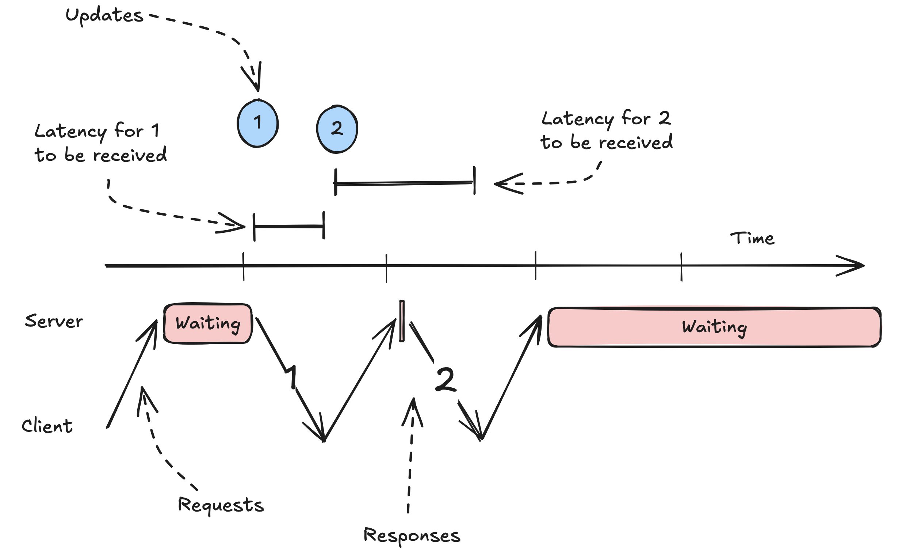

Real-time Updates addresses the challenge of delivering immediate notifications and data changes from servers to
clients as events occur. From chat applications where messages need instant delivery to live dashboards showing
real-time metrics, users expect to be notified the moment something happens. This pattern covers the architectural
approaches to enable low-latency, bidirectional communication.

When systems require real-time updates, push notifications, etc, the solution requires two distinct pieces:

1. The first "hop": how do we get updates from the server to the client?
2. The second "hop": how do we get updates from the source to the server?

## Updates from the server to the client

### Network Basics:

For a simple http call to go through, it has go through all the below steps.

1. **DNS Resolution:** The client starts by resolving the domain name of the website to an IP address using DNS (Domain
   Name System)
2. **TCP Handshake:** The client initiates a TCP connection with the server using a three-way handshake:
    1. **SYN:** The client sends a SYN (synchronize) packet to the server to request a connection.
    2. **SYN-ACK:** The server responds with a SYN-ACK (synchronize-acknowledge) packet to acknowledge the request.
    3. **ACK:** The client sends an ACK (acknowledge) packet to establish the connection.
3. **HTTP Request:** Once the TCP connection is established, the client sends an HTTP GET request to the server to
   request the web page.
4. **Server Processing:** The server processes the request, retrieves the requested web page, and prepares an HTTP
   response.
5. **HTTP Response:** The server sends the HTTP response back to the client, which includes the requested web page
   content.
6. **TCP Teardown:** After the data transfer is complete, the client and server close the TCP connection using a
   four-way handshake:
    1. **FIN:** The client sends a FIN (finish) packet to the server to terminate the connection.
    2. **ACK:** The server acknowledges the FIN packet with an ACK.
    3. **FIN:** The server sends a FIN packet to the client to terminate its side of the connection.
    4. **ACK:** The client acknowledges the server's FIN packet with an ACK.

Since opening up and closing a connection is expensive, there are other mechanisms developed to optimise this.

### Long Polling

After a baseline for simple polling, long polling is the easiest approach to achieving near real-time updates. It builds
on standard HTTP, making it easy to implement and scale.

The idea is also simple: the client makes a request to the server and the server holds the request open until new data
is available. It's as if the server is just taking really long to process the request. The server then responds with the
data, finalizes the HTTP requests, and the client immediately makes a new HTTP request. This repeats until the server
has new data to send. If no data has come through in a long while, we might even return an empty response to the client
so that they can make another request.

For our chat app, we would keep making a request to get the next message. If there was no message to retrieve, the
server would just hold the request open until a new message was sent before responding to us. After we received that
message, we'd make a new request for the next message.

1. Client makes HTTP request to server
2. Server holds request open until new data is available
3. Server responds with data
4. Client immediately makes new request
5. Process repeats

The simplicity of the approach hides an important trade-off for high-frequency updates. Since the client needs to "call
back" to the server after each receipt, the approach can introduce some extra latency

#### Advantages

* Builds on standard HTTP and works everywhere HTTP works.
* Easy to implement.
* No special infrastructure needed.
* Stateless server-side.

#### Disadvantages

* Higher latency than alternatives.
* More HTTP overhead.
* Can be resource-intensive with many clients.
* Not suitable for frequent updates due to the issues mentioned above.
* Makes monitoring more painful since requests can hang around for a long time.
* Browsers limit the number of concurrent connections per domain, meaning you may only be able to have a few
  long-polling connections per domain.

#### When to Use Long Polling

Long polling is a great solution for near real-time updates with a simple implementation. It's a good choice when
updates are infrequent and a simple solution is preferred. If the latency trade-off of a simple polling solution is at
all an issue, long-polling is an obvious upgrade with minimal additional complexity.

Long Polling is a great solution for applications where a long async process is running but you want to know when it
finishes, as soon as it finishes - like is often the case in payment processing. We'll long-poll for the payment status
before showing the user a success page.

#### Things to Discuss in Your Interview

Because long-polling utilizes the existing HTTP infrastructure, there's not a bunch of extra infrastructure you're going
to need to talk through. Even though the polling is "long", you still do need to be specific about the polling
frequency. Keep in mind that each hop in your infrastructure needs to be aware of these lengthy requests: you don't want
your load balancer hanging up on the client after 30 seconds when your long-polling server is happy to keep the
connection open for 60 (15-30s is a pretty common polling interval that minimizes the fuss here).

### Server Sent Events (SSE)

SSE is an extension on long-polling that allows the server to send a stream of data to the client.  
Normally HTTP responses have a header like Content-Length which tells the client how much data to expect. SSE instead
uses a special header Transfer-Encoding: chunked which tells the client that the response is a series of chunks - we
don't know how many there are or how big they are until we send them. This allows us to move from a single, atomic
request/response to a more granular "stream" of data.

With SSE, instead of sending a full response once data becomes available, the server sends a chunk of data and then
keeps the request open to send more data as needed. SSE is perfect for scenarios where servers need to push data to
clients, but clients don't need to send data back frequently.

Normally HTTP responses have a header like Content-Length which tells the client how much data to expect. SSE instead
uses a special header Transfer-Encoding: chunked which tells the client that the response is a series of chunks - we
don't know how many there are or how big they are until we send them. This allows us to move from a single, atomic
request/response to a more granular "stream" of data.

With SSE, instead of sending a full response once data becomes available, the server sends a chunk of data and then
keeps the request open to send more data as needed. SSE is perfect for scenarios where servers need to push data to
clients, but clients don't need to send data back frequently.
In our chat app, we would open up a request to stream messages and then each new message would be sent as a chunk to the
client.

How SSE Works

1. Client establishes SSE connection
2. Server keeps connection open
3. Server sends messages when data changes or updates happen
4. Client receives updates in real-time

#### Advantages

* Built into browsers.
* Automatic reconnection.
* Works over HTTP.
* More efficient than long polling due to less connection initiation/teardown.
* Simple to implement.

#### Disadvantages

* One-way communication only.
* Limited browser support (not an issue for modern browsers).
* Some proxies and networking equipment don't support streaming. Nasty to debug!
* Browsers limit the number of concurrent connections per domain, meaning you may only be able to have a few SSE
* connections per domain.
* Makes monitoring more painful since requests can hang around for a long time.

#### When to Use SSE

SSE is a great upgrade to long-polling because it eliminates the issues around high-frequency updates while still
building on top of standard HTTP. That said, it comes with lesser overall support because you'll need both browsers and
and/all infra between the client and server to support streaming responses.

A very popular use-case for SSE today is AI chat apps which frequently involve the need to stream new tokens (words) to
the user as they are generated to keep the UI responsive.

An example of an infra gap is that many proxies and load balancers don't support streaming responses. In these cases,
the proxy will try to buffer the response until it completes - which effectively blocks our stream in an annoying,
opaque way that is hard to debug! 2

As an aside: most interviewers will not be familiar with the infrastructure considerations associated with SSE and
aren't going to ask you detailed questions about them. But if the role you're interviewing for is very frontend-centric
be prepared in case they expect you to know your stuff!

#### Things to Discuss in Your Interview

SSE rides on existing HTTP infrastructure, so there's not a lot of extra infrastructure you'll need to talk through. You
also don't have a polling interval to negotiate or tune.

Most SSE connections won't be super-long-lived (e.g. 30-60s is pretty typical), so if you need to send messages for a
longer period you'll need to talk about how clients re-establish connections and how they deal with the gaps in between.
The SSE standard includes a "last event ID" which is intended to cover this gap, and the EventSource object in browsers
explicitly handles this reconnection logic. If a client loses its connection, it can reconnect and provide the last
event ID it received. The server can then use that ID to send all the events that occurred while the client was
disconnected.

### Websockets

WebSockets are the go-to choice for true bi-directional communication between client and server. If you have high
frequency writes and reads.
Websockets build on HTTP through an "upgrade" protocol, which allows an existing TCP connection to change L7 protocols.
This is super convenient because it means you can utilize some of the existing HTTP session information (e.g. cookies,
headers, etc.) to your advantage.

Note: Just because clients can upgrade from HTTP to WebSocket doesn't mean that the infrastructure will support it.
Every piece of infrastructure between the client and server will need to support WebSocket connections.

Once a connection is established, both client and server can send "messages" to each other which are effectively opaque
binary blobs. You can shove strings, JSON, Protobufs, or anything else in there. Think of WebSockets like a TCP
connection with some niceties that make establishing the connection easier, especially for browsers.

1. Client initiates WebSocket handshake over HTTP
2. Connection upgrades to WebSocket protocol
3. Both client and server can send messages
4. Connection stays open until explicitly closed

#### Advantages

* Full-duplex (read and write) communication.
* Lower latency than HTTP due to reduced overhead (e.g. no headers).
* Efficient for frequent messages.
* Wide browser support.

#### Disadvantages

* More complex to implement.
* Requires special infrastructure.
* Stateful connections, can make load balancing and scaling more complex.
* Need to handle reconnection.

#### When to Use WebSockets

Generally speaking, if you need high-frequency, bi-directional communication, you're going to want to use WebSocket. I'm
emphasizing high-frequency here because you can always make additional requests/connections for writes: a very common
pattern is to have SSE subscriptions for updates and do writes over simple HTTP POST/PUT whenever they occur.
I often find candidates too eagerly adopting Websockets when they could be using SSE or simple polling instead. Because
of the additional complexity and infra lift, you'll want to defer to SSE unless you have a specific need for this
bi-directional communication.

#### Things to Discuss in Your Interview

Websockets are a powerful tool, but they do come with a lot of complexity. You'll want to talk through how you'll manage
connections and deal with reconnections. You'll also need to consider how your deployment strategy will handle server
restarts.
Managing statefulness is a big part of the conversation. Senior/staff candidates will frequently talk about how to
minimize the spread of state across their architecture.
There's also a lot to discuss about how to scale WebSocket servers. Load can be uneven which can result in hotspots and
failures. Using a "least connections" strategy for the load balancer can help, as well as minimizing the amount of work
the WebSocket servers need to do as they process messages. Using the reference architecture above and offloading more
intensive processing to other services (which can scale independently) can help.

### WebRTC: The Peer-to-Peer Solution

WebRTC enables direct peer-to-peer communication between browsers, perfect for video/audio calls and some data sharing
like document editors. Clients talk to a central "signaling server" which keeps track of which peers are available
together with their connection information. Once a client has the connection information for another peer, they can try
to establish a direct connection without going through any intermediary servers.

In practice, most clients don't allow inbound connections for security reasons (the exception would be servers which
broadcast their availability on specific ports at specific addresses) using devices like NAT (network address
translation). So if we stopped there, most peers wouldn't be able to "speak" to each other.

The WebRTC standard includes two methods to work around these restrictions:
STUN: "Session Traversal Utilities for NAT" is a protocol and a set of techniques like "hole punching" which allows
peers to establish publically routable addresses and ports. I won't go into details here, but as hacky as it sounds it's
a standard way to deal with NAT traversal and it involves repeatedly creating open ports and sharing them via the
signaling server with peers.
TURN: "Traversal Using Relays around NAT" is effectively a relay service, a way to bounce requests through a central
server which can then be routed to the appropriate peer.

WebRTC Setup
In practice, the signaling server is relatively lightweight and isn't handling much of the bandwidth as the bulk of the
traffic is handled by the peer-to-peer connections. But interestingly the signaling server does effectively act as a
real-time update system for its clients (so they can find their peers and update their connection info) so it either
needs to utilize WebSockets, SSE, or some other approach detailed above.
For our chat app, we'd connect to our signaling server over a WebSocket connection to find all of our peers (others in
the chat room). Once we'd identified them and exchanged connection information, we'd be able to establish direct
peer-to-peer connections with them. Chat messages would be broadcast by room participants to all of their peers (or, if
you want to be extra fancy, bounced between participants until they settle).
How WebRTC Works
Ok, but how does it work?
Peers discover each other through signaling server.
Exchange connection info (ICE candidates)
Establish direct peer connection, using STUN/TURN if needed
Stream audio/video or send data directly
Pretty simple, apart from the acronyms and NAT traversal.
// Simplified WebRTC setup
async function startCall() {
const pc = new RTCPeerConnection();

// Get local stream
const stream = await navigator.mediaDevices.getUserMedia({
video: true,
audio: true
});

// Add tracks to peer connection
stream.getTracks().forEach(track => {
pc.addTrack(track, stream);
});

// Create and send offer
const offer = await pc.createOffer();
await pc.setLocalDescription(offer);

// Send offer to signaling server
signalingServer.send(offer);
}
When to Use WebRTC
WebRTC is the most complex and heavyweight of the options we've discussed. It's overkill for most real-time update use
cases, but it's a great tool for scenarios like video/audio calls, screen sharing, and gaming.
The notable exception is that it can be used to reduce server load. If you have a system where clients need to talk to
each other frequently, you could use WebRTC to reduce the load on your servers by having clients establish their own
connections. Canva took this approach with presence/pointer sharing in their canvas editor and it's a popular approach
from collaborative document editing like Google Docs when used in conjunction with CRDTs which are better suited for a
peer-to-peer architecture.
Advantages
Direct peer communication
Lower latency
Reduced server costs
Native audio/video support
Disadvantages
Complex setup (> WebSockets)
Requires signaling server
NAT/firewall issues
Connection setup delay
Things to Discuss in Your Interview
If you're building a WebRTC app in a system design interview, it should be really obvious why you're using it. Either
you're trying to do video conferencing or the scale strictly requires you to have clients talk to each other directly.
Some interviews will get cute and introduce unrealistic constraints to try to get you to think outside the box, like "
the system must run on Raspberry Pi". These might be a case where a peer-to-peer architecture makes sense, but tread
carefully.
Having some knowledge of the infra requirements (STUN/TURN, signaling servers, etc.) will give you the flexibility to
make the best design decision for your system. You'll also want to speak pretty extensively about the communication
patterns between peer clients and any eventual synchronization to a central server (almost all design questions will
have some calling home to the mothership to store data or report results).

## References

1. https://www.hellointerview.com/learn/system-design/patterns/realtime-updates