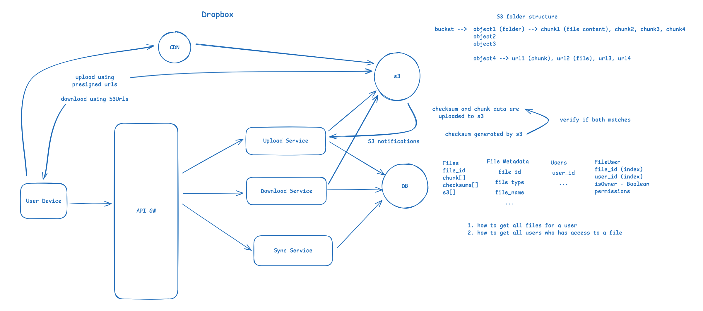

## Design Dropbox

https://excalidraw.com/#json=MLbh7RNKbXtlmgCIVU_NU,xmEFG0XO1bY74jC3XO7XXQ

FR:
1. Upload files
2. Download files
3. Sync files in devices

below the line:
1. user account management
2. permissions
3. sharing files

NFR:
1. System Specific
    1. should be able upload large files
2. CAP Theorem
    1. Sycning Service (Availability >> Consistency)
    2. Uploading Files (CP)
    3. Downloading Files (CP)
3. Latency
    1. Downloading and uploading should be fast (optimized)
4. Scalability
    1. Should handle large volume of request (uploads/downlaods)
5. Fault Tolerance
    1. Resumable uploads/downloads when the system goes offline
6. Read vs Write
    1. read > write (not significant)

Core Entities:
1. Files
   user_id
   file_id
   s3[]
   ...

2. File Metadata
   file_id
   file type
   file_name
   ...

3. Users
   user_id
   ...

API Design:

1. POST /api/v1/uploadRequest -- S3Url[]
   {
   fileMetadata
   }

2. POST /s3presigned_url
   {
   chunk
   }

3. GET /api/v1/sync?lastSyncTimestamp -- List<Files && FileMetadata>

4. GET /api/v1/download?file_id 

NFR:
1. System Specific
    1. should be able upload large files
       ** upload directly to S3
2. CAP Theorem
    1. Syncing Service (Availability >> Consistency)
       ** scale Sync Service independently
    2. Uploading Files (CP)
       ** chunking and resuming to maintain consisteny
    3. Downloading Files (CP)
       ** chunking and resuming to maintain consisteny
3. Latency
    1. Downloading and uploading should be fast (optimized)
       ** compress and uncompress chunks
       ** CDN for faster Downloads
4. Scalability
    1. Should handle large volume of request (uploads/downloads)
       ** scaling upload/download services
       ** create read replicas
5. Fault Tolerance
    1. Resumable uploads/downloads when the system goes offline
        1. **split them into chunks
6. Read vs Write
    1. read > write (not significant)
       ** Relational or Non Relational should work equally

upload a file

1. user requests upload for a file and passes metadata
   file size, file type, file name, checksums for chunks ...

2. Upload service will create a new entry in the bucket for the file
3. Upload service will also creates chunkId's and gets s3presigned url's
   for these chunks
4. Upload service will return chunk to s3 urls
   chunk1 - s3url1
   chunk2 - s3url2
5. User device will break the file into chunks and upload to respective
   S3presigned url

Sync
1. User requests sync after a particular timestamp
2. Sync service will return all the changes to the files after lastModified Date
3. User Device will download/delete files respectively

PreSigned URLs:
1. Pre defined Auth
2. Expire in some time
3. Take only certain file types