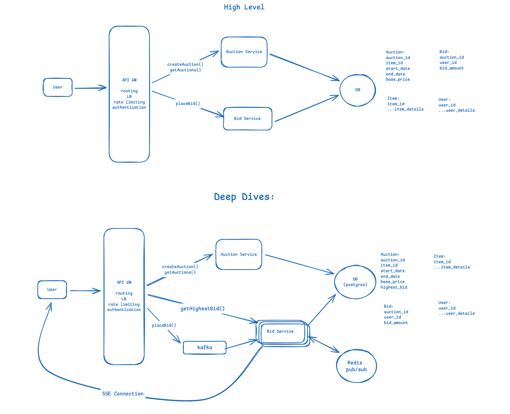

## Design Online Auction like ebay

Excalidraw link: https://excalidraw.com/#json=ukN2NRDQa4ayylCQjvRIt,nt38bewUBpotl640FyeRvA

FR:
1. User should be able to create auction (with start_date/end_date and base price)
2. User should be able to place a bid (only bids higher than the current price are accepted)
3. User should be able to view auctions (including highest bid)

Scale:
1. 10M concurrent auctions

NFR:
1. Bids should be real time (i.e. users should be able to see the current highest bid in real-time)
2. CAP Theorem:
    1. CP system, the bid amount should be consistent for all users
3. Fault Tolerance:
    1. No Auctions/Bids should be dropped
4. Scalability:
    1. Should be able to scale for 10M concurrent auctions

Core Entities:
1. User
2. Item
3. Auction
4. Bid

API Design:
POST /api/v1/auction --> Auction
{
item_name
item_description
items_photos
auction_start_date
auction_end_date
auction_start_bid_amount
}

POST /api/v1/auction/bid --> Bid
{
auction_id
bid_amount
}

GET /api/v1/auctions --> List<Auction>

Deep dives: 
NFR:
1. Bids should be real time (i.e. users should be able to see the current highest bid in real-time)
    1. Pattern: Dealing with Contention
    2. Dealing with race condition (2 Users placing bid at the same time)
        1. Using PCC (pessimistic concurrency control) by placing locks on the rows you are about to update. But this would mean, you will be placing locks on all row for the auction in the Bids table.
           So create a column in the "Auction" table to track the highest price and place a lock on it.
           Ex: SELECT highest_bid FROM Auction WHERE auction_id = 1234 FOR UPDATE
        2. OCC can be used here but it useful when the conflicts are rare. If you think that the concurrent bids happens rarely, use OCC.
    3. Dealing with real time updates of latest bid price
        1. Opening an SSE connection from Bid Service to the user will give real time updates.
        2. Use redis pub/sub to pass in the messages b/w servers to notify users (just like whatsapp)
2. CAP Theorem:
    1. CP system, the bid amount should be consistent for all users
        1. Use relational DB which supports strong consistency natively.
3. Fault Tolerance:
    1. No Auctions/Bids should be dropped
        1. what if the Bid service is down? some of the bids will be lost.
            1. Use a messaging queue to take in bids and let the bid service pull from the queue, this way even if the bid service is entirely down, the messages are still present on the Queue and will be
               pulled when the bid service is back up again.
4. Scalability:
    1. Should be able to scale for 10M concurrent auctions
        1. Check (from left to right) if each system can handle the load?
            1. 10M concurrent auctions, 100 bids per auction  = 1B bids/day = 10K bids/second.
            2. Kafka can easily handle 10K messages per seconds, so no partition is required.
            3. Bid service can be scaled horizontally to handle these requests.
            4. SSE connections:
                1. lets assume there are 100M DAU, thats a lot of connects to handle by one bid server. So users connect to multiple servers, but coordination would be an issue.
                   So use redis pub/sub to coordinate.
            5. Database
                1. If each auction lasts for a week and 1kb for auction and 500bytes/bid
                   = 10M * 52(weeks per year) * (1kb + 0.5kb * 100 bids/auction) = 25TB/year
                   = 250 TB/10 years
